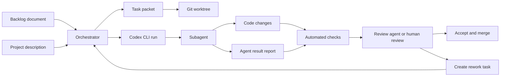
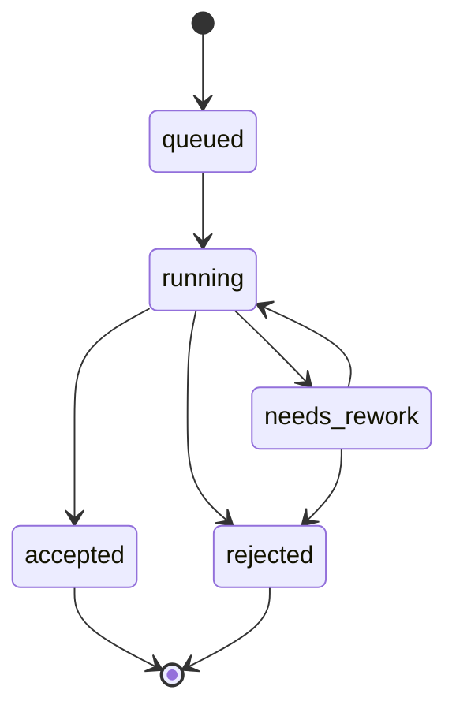

# Руководство для оркестратора и Codex-субагентов проекта `tg-market-watch`

**Документ:** третий дополнительный документ к проекту `tg-market-watch`  
**Назначение:** описать, как один оркестратор должен выдавать задачи субагентам через Codex CLI, контролировать изоляцию работ, принимать результаты, запускать проверки и решать, можно ли включать изменения в основную ветку.  
**Связанные документы:**

- `telegram_user_market_watch_project.md` — архитектурное описание проекта.
- `telegram_user_market_watch_backlog.md` — backlog с фичами, требованиями и критериями приёмки.

Документ рассчитан на самостоятельную разработку агентами. Он задаёт единый операционный протокол: как формировать task packet, как запускать Codex CLI, как агент должен сдавать результат, как оркестратор проверяет работу и что делать при ошибках.

---

## 1. Цель операционной схемы

В проекте есть один управляющий процесс или один человек-оркестратор. Оркестратор не пишет весь код вручную, а распределяет задачи между специализированными Codex-субагентами. Каждый субагент получает одну ограниченную задачу, работает в отдельном git worktree, сдаёт изменения и отчёт. Оркестратор принимает результат только после автоматических проверок, ручной или агентной ревизии diff и сверки с критериями приёмки из backlog.

Главные свойства процесса:

1. **Изоляция:** один агент не ломает работу другого, потому что каждая задача выполняется в отдельном worktree и отдельной ветке.
2. **Проверяемость:** каждый результат содержит машинно-читаемый отчёт, список изменённых файлов, выполненные команды и статус по критериям приёмки.
3. **Управляемая автономность:** Codex запускается неинтерактивно через `codex exec` с заранее выбранными sandbox и approval режимами.
4. **Минимальная область изменений:** агенту запрещено менять файлы вне своей задачи и запрещено расширять scope без явного решения оркестратора.
5. **Безопасность:** секреты Telegram, Codex auth, session-файлы и личные данные не передаются агентам в prompt, не пишутся в git и не попадают в отчёты.
6. **Повторяемость:** любой запуск можно восстановить по task packet, prompt, JSONL-событиям, diff, отчёту агента и результатам проверок.

---

## 2. Базовая модель работы



Оркестратор работает с задачами как с независимыми поставками. Он не должен запускать агента с общей инструкцией «сделай весь проект». Вместо этого каждая задача должна быть достаточно маленькой, чтобы агент мог завершить её за один запуск или за короткую серию запусков `codex exec resume`.

---

## 3. Роли в процессе

### 3.1. Оркестратор

Оркестратор отвечает за весь lifecycle задачи:

- выбирает следующую задачу из backlog;
- проверяет зависимости задачи;
- создаёт task packet;
- создаёт отдельный git worktree и ветку;
- запускает Codex CLI;
- собирает stdout, stderr, JSONL-события и финальный отчёт;
- проверяет git diff;
- запускает тесты, линтеры и type-check;
- сверяет результат с критериями приёмки;
- принимает задачу, отправляет на доработку или отклоняет;
- обновляет статус задачи в `orchestrator/tasks`;
- мержит только проверенные изменения.

Оркестратор не должен передавать агентам реальные секреты. Для задач, где нужны интеграционные проверки Telegram, оркестратор либо использует mock-слой, либо запускает такие проверки вручную в защищённом окружении.

### 3.2. Codex-субагент

Субагент — отдельный запуск Codex CLI с конкретным task packet. Он отвечает за реализацию только своей задачи.

Субагент обязан:

- прочитать `AGENTS.md`, task packet и указанные документы;
- не менять файлы вне разрешённой области;
- не использовать секреты и не создавать реальные Telegram session-файлы;
- писать код, тесты и документацию в рамках задачи;
- запускать проверки, разрешённые task packet;
- создать `agent_result.json` и `AGENT_RESULT.md`;
- честно указать, что не удалось выполнить;
- не мержить ветки и не менять основную ветку.

### 3.3. Review-субагент

Review-субагент запускается оркестратором в read-only режиме. Он не исправляет код, а проверяет diff, тесты, требования и риски. Его задача — дать заключение: `accept`, `needs_rework` или `reject`.

Review-субагент полезен для задач по security, Telegram-клиенту, rule engine и storage, где ошибка может привести к утечке секретов, дублям алертов или нестабильной обработке сообщений.

---

## 4. Рекомендуемая структура файлов для оркестрации

Эта структура добавляется в репозиторий проекта после bootstrap-этапа. Каталог `.agents` хранит неизменяемые инструкции и схемы. Каталог `orchestrator` хранит runtime-артефакты задач и результаты запусков.

```text
tg-market-watch/
  AGENTS.md
  docs/
    telegram_user_market_watch_project.md
    telegram_user_market_watch_backlog.md
    telegram_user_market_watch_agent_orchestrator_guide.md
  .codex/
    config.toml
  .agents/
    README.md
    roles.yaml
    policies.md
    schemas/
      task_packet.schema.json
      agent_result.schema.json
      review_result.schema.json
    prompt_parts/
      implementation_agent.md
      review_agent.md
      rework_agent.md
  orchestrator/
    README.md
    tasks/
      BL-0001.yaml
      BL-0101.yaml
      BL-0401.yaml
    runs/
      BL-0401/
        prompt.md
        codex_events.jsonl
        codex_stderr.log
        agent_final.md
        agent_result.json
        AGENT_RESULT.md
        git_diff.patch
        verification.log
        review_result.json
    scripts/
      build_prompt.py
      run_codex_task.sh
      verify_task.sh
      collect_result.py
      review_task.sh
  worktrees/
    bl-0401-normalization-core/
```

Важное правило: агенты читают `.agents`, но не должны его менять во время обычных задач. Изменения в `.agents`, `.codex` и `AGENTS.md` выполняются только отдельными задачами типа `process`, `infra` или `docs`, потому что эти файлы влияют на поведение всех последующих запусков.

---

## 5. Codex CLI: режимы, которые нужны оркестратору

### 5.1. Установка и запуск

Для разработки через CLI используется пакет `@openai/codex` или другой официальный способ установки Codex CLI. Базовая команда запуска интерактивной сессии:

```bash
codex
```

Для оркестратора основной режим — не интерактивный:

```bash
codex exec "summarize the repository structure and list risky areas"
```

### 5.2. Неинтерактивный запуск

`codex exec` используется для CI-style или scripted runs. В этом режиме prompt можно передать аргументом или через stdin:

```bash
cat orchestrator/runs/BL-0401/prompt.md | codex exec - --cd worktrees/bl-0401-normalization-core --sandbox workspace-write --ask-for-approval never
```

Рекомендуемый режим для реализации задач:

```bash
codex exec - \
  --cd worktrees/bl-0401-normalization-core \
  --sandbox workspace-write \
  --ask-for-approval never
```

Рекомендуемый режим для review-задач:

```bash
codex exec - \
  --cd worktrees/bl-0401-normalization-core \
  --sandbox read-only \
  --ask-for-approval never
```

### 5.3. JSONL-события

Для машинного мониторинга используется `--json`. События пишутся в stdout как JSON Lines. Оркестратор сохраняет их в файл:

```bash
cat orchestrator/runs/BL-0401/prompt.md | codex exec - \
  --cd worktrees/bl-0401-normalization-core \
  --sandbox workspace-write \
  --ask-for-approval never \
  --json \
  > orchestrator/runs/BL-0401/codex_events.jsonl \
  2> orchestrator/runs/BL-0401/codex_stderr.log
```

Если оркестратору нужен только финальный текст агента, можно запускать без `--json` и сохранять stdout:

```bash
cat orchestrator/runs/BL-0401/prompt.md | codex exec - \
  --cd worktrees/bl-0401-normalization-core \
  --sandbox workspace-write \
  --ask-for-approval never \
  > orchestrator/runs/BL-0401/agent_final.md \
  2> orchestrator/runs/BL-0401/codex_stderr.log
```

### 5.4. Sandbox и approval policy

Для разработки этого проекта рекомендуются только три режима:

| Сценарий | Команда | Разрешённое поведение |
|---|---|---|
| Реализация кода | `--sandbox workspace-write --ask-for-approval never` | Агент читает и меняет файлы внутри worktree. Сетевой доступ не нужен. |
| Review diff | `--sandbox read-only --ask-for-approval never` | Агент только читает файлы, diff и отчёты. |
| Диагностика сложной ошибки человеком | `--sandbox workspace-write --ask-for-approval on-request` | Интерактивная сессия с ручным подтверждением рискованных действий. |

Запрещённый стандартный режим для этого проекта:

```bash
codex exec --dangerously-bypass-approvals-and-sandbox "implement the task"
```

Такой запуск допустим только в одноразовом изолированном контейнере без секретов, без SSH-ключей, без Telegram session-файлов и без доступа к основной рабочей директории. В обычном процессе проекта он считается нарушением.

### 5.5. Аутентификация Codex

Для автоматизации предпочтительнее использовать API key, переданный через защищённое окружение. Если используется ChatGPT-managed auth, файл `~/.codex/auth.json` считается секретом уровня пароля. Его нельзя коммитить, копировать в prompt, вставлять в отчёты или передавать агентам.

В репозитории должны быть правила `.gitignore`, запрещающие попадание Codex auth и Telegram session файлов:

```gitignore
.codex/auth.json
.codex/*.json
*.session
*.session-journal
.env
.env.local
.env.production
telegram.session
telegram.session-journal
```

---

## 6. `AGENTS.md` для проекта

`AGENTS.md` — основной файл постоянных инструкций для Codex. Он должен быть коротким, но конкретным. Ниже рекомендуемое содержимое для репозитория `tg-market-watch`.

```markdown
# AGENTS.md для tg-market-watch

## Назначение проекта

Проект tg-market-watch — FastAPI-приложение, подключающееся к Telegram как user-аккаунт через MTProto-клиент, читающее сообщения из разрешённых русскоязычных групп, применяющее детерминированные YAML-правила и отправляющее алерты выбранному Telegram-пользователю.

## Главные документы

Перед выполнением задач читай:

1. docs/telegram_user_market_watch_project.md
2. docs/telegram_user_market_watch_backlog.md
3. docs/telegram_user_market_watch_agent_orchestrator_guide.md
4. task packet из orchestrator/tasks

## Нельзя

- Нельзя добавлять реальные Telegram session-файлы, номера телефонов, API ID, API hash, 2FA-пароли, OpenAI auth и любые секреты в git.
- Нельзя реализовывать автоматическое вступление в закрытые группы, обход приватности Telegram, массовую рассылку или спам.
- Нельзя использовать LLM в runtime для принятия решения о совпадении объявления в MVP.
- Нельзя менять scope задачи без явного указания task packet.
- Нельзя менять .agents, .codex и AGENTS.md, если задача не посвящена процессу разработки.

## Архитектурные принципы

- Детерминированность: одинаковый текст и одинаковый YAML-конфиг дают одинаковое решение.
- Объяснимость: каждое совпадение содержит evidence и decision trace.
- Атомарная перезагрузка конфига: невалидный YAML не ломает активные правила.
- Защита от дублей: одно сообщение не создаёт повторные алерты без явной причины.
- Безопасность секретов важнее удобства тестов.

## Технические ожидания

- Python-код должен быть типизирован там, где это влияет на контракты модулей.
- Тесты должны покрывать новую бизнес-логику.
- Ошибки должны обрабатываться явно.
- Новое пользовательское поведение должно быть описано в документации или README.
- Изменения в YAML-схеме должны сопровождаться тестами валидации.

## Формат сдачи агентом

Каждая задача должна завершаться созданием файлов:

- AGENT_RESULT.md
- agent_result.json

В отчёте укажи изменённые файлы, выполненные команды, статус критериев приёмки и оставшиеся риски.
```

---

## 7. Task packet

Task packet — единственный источник правды для конкретного запуска агента. Он создаётся оркестратором на основе backlog-карточки и содержит scope, критерии приёмки, разрешённые файлы, команды проверки и формат сдачи.

### 7.1. Правила task packet

1. Одна задача — один task packet.
2. Task packet должен быть самодостаточным: агенту не нужно спрашивать, что делать.
3. В task packet должны быть конкретные файлы и директории, которые можно менять.
4. В task packet должны быть конкретные команды проверки.
5. В task packet не должно быть секретов.
6. В task packet не должно быть конфликтующих требований.
7. Если задача требует изменения публичного контракта, task packet обязан включать обновление документации.

### 7.2. Пример task packet для задачи нормализации

Файл: `orchestrator/tasks/BL-0401.yaml`

```yaml
task_id: BL-0401
title: Реализовать базовое ядро нормализации русскоязычных сообщений
status: queued
priority: P0
role: NLP
branch: agent/bl-0401-normalization-core
worktree: worktrees/bl-0401-normalization-core
source_documents:
  - docs/telegram_user_market_watch_project.md
  - docs/telegram_user_market_watch_backlog.md
  - docs/telegram_user_market_watch_agent_orchestrator_guide.md
backlog_refs:
  - BL-0401
objective: >-
  Реализовать модуль нормализации текста для сообщений Telegram: Unicode cleanup,
  lower-case, нормализация смешанной кириллицы и латиницы, приведение единиц измерения,
  токенизация и подготовка данных для rule engine.
context: >-
  Нормализация является P0-зависимостью для извлечения сущностей и детерминированных
  правил по телевизорам 50+ дюймов, MacBook M4 Pro и AirPods Pro 2.
allowed_paths:
  - app/normalization
  - app/core
  - tests/normalization
  - docs/normalization.md
  - pyproject.toml
forbidden_paths:
  - .agents
  - .codex
  - AGENTS.md
  - app/telegram
  - app/alerts
  - app/storage
  - config/production.yaml
  - .env
  - '*.session'
requirements:
  - Создать публичную функцию normalize_text, возвращающую объект NormalizedText.
  - Сохранить исходный текст, нормализованный текст, список токенов и список применённых преобразований.
  - Поддержать замену похожих латинских символов в русских словах: a, e, o, p, c, x, y, k, m, t, b, h.
  - Поддержать нормализацию вариантов дюймов: дюйм, дюйма, дюймов, inches, inch, in, двойная кавычка.
  - Поддержать нормализацию пробелов, emoji-разделителей, пунктуации и повторяющихся символов.
  - Не использовать внешние ML или LLM библиотеки.
  - Добавить unit-тесты на русские объявления с шумом, emoji и смешанной раскладкой.
acceptance_criteria:
  - Кейс "продам телевизор 55 дюймов" нормализуется с токеном tv_size_unit:inch или эквивалентным детерминированным признаком.
  - Кейс "MacBооk M4 Prо" со смешанными латинскими и кириллическими символами приводится к стабильному виду.
  - Кейс "AirPods Pro 2" сохраняет различимые токены airpods, pro, 2.
  - normalize_text не изменяет исходную строку в поле raw_text.
  - Тесты tests/normalization проходят без сетевого доступа.
commands:
  test:
    - python -m pytest tests/normalization -q
  lint:
    - python -m ruff check app/normalization tests/normalization
  typecheck:
    - python -m mypy app/normalization
expected_outputs:
  - app/normalization/__init__.py
  - app/normalization/models.py
  - app/normalization/normalizer.py
  - tests/normalization/test_normalizer.py
  - docs/normalization.md
  - AGENT_RESULT.md
  - agent_result.json
result_contract:
  json_schema: .agents/schemas/agent_result.schema.json
notes_for_agent:
  - При отсутствии ruff или mypy в проекте обнови pyproject.toml так, чтобы команды стали доступными.
  - Не добавляй зависимости, если задача решается стандартной библиотекой.
  - При изменении pyproject.toml укажи это в отчёте.
```

---

## 8. JSON Schema для task packet

Файл: `.agents/schemas/task_packet.schema.json`

```json
{
  "$schema": "https://json-schema.org/draft/2020-12/schema",
  "title": "tg-market-watch task packet",
  "type": "object",
  "additionalProperties": false,
  "required": [
    "task_id",
    "title",
    "status",
    "priority",
    "role",
    "branch",
    "worktree",
    "source_documents",
    "objective",
    "allowed_paths",
    "forbidden_paths",
    "requirements",
    "acceptance_criteria",
    "commands",
    "expected_outputs",
    "result_contract"
  ],
  "properties": {
    "task_id": {
      "type": "string",
      "pattern": "^BL-[0-9]{4}$"
    },
    "title": {
      "type": "string",
      "minLength": 5
    },
    "status": {
      "type": "string",
      "enum": ["queued", "running", "needs_rework", "accepted", "rejected"]
    },
    "priority": {
      "type": "string",
      "enum": ["P0", "P1", "P2"]
    },
    "role": {
      "type": "string",
      "enum": ["ARCH", "API", "TG", "CFG", "NLP", "RULES", "DB", "ALERT", "QA", "DEVOPS", "DOCS", "SECURITY", "REVIEW"]
    },
    "branch": {
      "type": "string",
      "pattern": "^agent/[a-z0-9-]+$"
    },
    "worktree": {
      "type": "string",
      "pattern": "^worktrees/[a-z0-9-]+$"
    },
    "source_documents": {
      "type": "array",
      "minItems": 1,
      "items": {
        "type": "string"
      }
    },
    "backlog_refs": {
      "type": "array",
      "items": {
        "type": "string"
      }
    },
    "objective": {
      "type": "string",
      "minLength": 20
    },
    "context": {
      "type": "string"
    },
    "allowed_paths": {
      "type": "array",
      "minItems": 1,
      "items": {
        "type": "string"
      }
    },
    "forbidden_paths": {
      "type": "array",
      "items": {
        "type": "string"
      }
    },
    "requirements": {
      "type": "array",
      "minItems": 1,
      "items": {
        "type": "string"
      }
    },
    "acceptance_criteria": {
      "type": "array",
      "minItems": 1,
      "items": {
        "type": "string"
      }
    },
    "commands": {
      "type": "object",
      "additionalProperties": {
        "type": "array",
        "items": {
          "type": "string"
        }
      }
    },
    "expected_outputs": {
      "type": "array",
      "items": {
        "type": "string"
      }
    },
    "result_contract": {
      "type": "object",
      "additionalProperties": false,
      "required": ["json_schema"],
      "properties": {
        "json_schema": {
          "type": "string"
        }
      }
    },
    "notes_for_agent": {
      "type": "array",
      "items": {
        "type": "string"
      }
    }
  }
}
```

---

## 9. Контракт результата агента

Агент сдаёт два файла в корне своего worktree:

```text
AGENT_RESULT.md
agent_result.json
```

`AGENT_RESULT.md` нужен для человека. `agent_result.json` нужен для оркестратора, автоматической проверки и истории запусков.

### 9.1. JSON Schema результата

Файл: `.agents/schemas/agent_result.schema.json`

```json
{
  "$schema": "https://json-schema.org/draft/2020-12/schema",
  "title": "tg-market-watch agent result",
  "type": "object",
  "additionalProperties": false,
  "required": [
    "task_id",
    "status",
    "summary",
    "changed_files",
    "commands_run",
    "acceptance",
    "risks",
    "follow_up_tasks"
  ],
  "properties": {
    "task_id": {
      "type": "string",
      "pattern": "^BL-[0-9]{4}$"
    },
    "status": {
      "type": "string",
      "enum": ["completed", "partial", "blocked", "failed"]
    },
    "summary": {
      "type": "string",
      "minLength": 20
    },
    "changed_files": {
      "type": "array",
      "items": {
        "type": "object",
        "additionalProperties": false,
        "required": ["path", "change_type", "reason"],
        "properties": {
          "path": {
            "type": "string"
          },
          "change_type": {
            "type": "string",
            "enum": ["created", "modified", "deleted", "renamed"]
          },
          "reason": {
            "type": "string"
          }
        }
      }
    },
    "commands_run": {
      "type": "array",
      "items": {
        "type": "object",
        "additionalProperties": false,
        "required": ["command", "exit_code", "result"],
        "properties": {
          "command": {
            "type": "string"
          },
          "exit_code": {
            "type": "integer"
          },
          "result": {
            "type": "string",
            "enum": ["passed", "failed", "not_run"]
          },
          "notes": {
            "type": "string"
          }
        }
      }
    },
    "acceptance": {
      "type": "array",
      "items": {
        "type": "object",
        "additionalProperties": false,
        "required": ["criterion", "status", "evidence"],
        "properties": {
          "criterion": {
            "type": "string"
          },
          "status": {
            "type": "string",
            "enum": ["passed", "failed", "not_checked"]
          },
          "evidence": {
            "type": "string"
          }
        }
      }
    },
    "risks": {
      "type": "array",
      "items": {
        "type": "object",
        "additionalProperties": false,
        "required": ["risk", "severity", "mitigation"],
        "properties": {
          "risk": {
            "type": "string"
          },
          "severity": {
            "type": "string",
            "enum": ["low", "medium", "high"]
          },
          "mitigation": {
            "type": "string"
          }
        }
      }
    },
    "follow_up_tasks": {
      "type": "array",
      "items": {
        "type": "object",
        "additionalProperties": false,
        "required": ["title", "reason", "priority"],
        "properties": {
          "title": {
            "type": "string"
          },
          "reason": {
            "type": "string"
          },
          "priority": {
            "type": "string",
            "enum": ["P0", "P1", "P2"]
          }
        }
      }
    }
  }
}
```

### 9.2. Пример `agent_result.json`

```json
{
  "task_id": "BL-0401",
  "status": "completed",
  "summary": "Реализовано базовое ядро нормализации русскоязычных сообщений с Unicode cleanup, нормализацией похожих символов, единиц измерения и токенизацией.",
  "changed_files": [
    {
      "path": "app/normalization/models.py",
      "change_type": "created",
      "reason": "Добавлены модели NormalizedText и NormalizationStep."
    },
    {
      "path": "app/normalization/normalizer.py",
      "change_type": "created",
      "reason": "Добавлена функция normalize_text и детерминированные преобразования."
    },
    {
      "path": "tests/normalization/test_normalizer.py",
      "change_type": "created",
      "reason": "Добавлены unit-тесты на шумные русскоязычные объявления."
    },
    {
      "path": "docs/normalization.md",
      "change_type": "created",
      "reason": "Описаны этапы нормализации и ограничения MVP."
    }
  ],
  "commands_run": [
    {
      "command": "python -m pytest tests/normalization -q",
      "exit_code": 0,
      "result": "passed",
      "notes": "Все тесты нормализации прошли."
    },
    {
      "command": "python -m ruff check app/normalization tests/normalization",
      "exit_code": 0,
      "result": "passed",
      "notes": "Ошибки линтинга не обнаружены."
    },
    {
      "command": "python -m mypy app/normalization",
      "exit_code": 0,
      "result": "passed",
      "notes": "Типизация модуля нормализации проверена."
    }
  ],
  "acceptance": [
    {
      "criterion": "Кейс \"продам телевизор 55 дюймов\" нормализуется с признаком inch.",
      "status": "passed",
      "evidence": "Тест test_tv_inches_unit_normalization проверяет токены tv, 55 и inch."
    },
    {
      "criterion": "Кейс \"MacBооk M4 Prо\" приводится к стабильному виду.",
      "status": "passed",
      "evidence": "Тест test_mixed_cyrillic_latin_macbook проверяет результат macbook m4 pro."
    },
    {
      "criterion": "AirPods Pro 2 сохраняет различимые токены.",
      "status": "passed",
      "evidence": "Тест test_airpods_tokens проверяет airpods, pro и 2."
    }
  ],
  "risks": [
    {
      "risk": "Нормализация похожих символов может ошибочно менять латинские слова вне товарных названий.",
      "severity": "medium",
      "mitigation": "Преобразование ограничено токенами с кириллическим контекстом и покрыто regression-тестами."
    }
  ],
  "follow_up_tasks": [
    {
      "title": "Добавить golden corpus для нормализации объявлений из реальных групп без персональных данных",
      "reason": "Нужен устойчивый regression-набор для расширения словарей.",
      "priority": "P1"
    }
  ]
}
```

---

## 10. Контракт review-субагента

Review-субагент сдаёт файл:

```text
review_result.json
```

### 10.1. JSON Schema review-результата

Файл: `.agents/schemas/review_result.schema.json`

```json
{
  "$schema": "https://json-schema.org/draft/2020-12/schema",
  "title": "tg-market-watch review result",
  "type": "object",
  "additionalProperties": false,
  "required": [
    "task_id",
    "decision",
    "summary",
    "checks",
    "blocking_issues",
    "non_blocking_issues",
    "recommended_next_action"
  ],
  "properties": {
    "task_id": {
      "type": "string",
      "pattern": "^BL-[0-9]{4}$"
    },
    "decision": {
      "type": "string",
      "enum": ["accept", "needs_rework", "reject"]
    },
    "summary": {
      "type": "string"
    },
    "checks": {
      "type": "array",
      "items": {
        "type": "object",
        "additionalProperties": false,
        "required": ["name", "status", "evidence"],
        "properties": {
          "name": {
            "type": "string"
          },
          "status": {
            "type": "string",
            "enum": ["passed", "failed", "not_checked"]
          },
          "evidence": {
            "type": "string"
          }
        }
      }
    },
    "blocking_issues": {
      "type": "array",
      "items": {
        "type": "object",
        "additionalProperties": false,
        "required": ["issue", "file", "required_fix"],
        "properties": {
          "issue": {
            "type": "string"
          },
          "file": {
            "type": "string"
          },
          "required_fix": {
            "type": "string"
          }
        }
      }
    },
    "non_blocking_issues": {
      "type": "array",
      "items": {
        "type": "object",
        "additionalProperties": false,
        "required": ["issue", "file", "suggestion"],
        "properties": {
          "issue": {
            "type": "string"
          },
          "file": {
            "type": "string"
          },
          "suggestion": {
            "type": "string"
          }
        }
      }
    },
    "recommended_next_action": {
      "type": "string",
      "enum": ["merge", "create_rework_task", "discard_branch", "manual_review"]
    }
  }
}
```

### 10.2. Пример review prompt

Файл: `.agents/prompt_parts/review_agent.md`

```markdown
Ты review-субагент проекта tg-market-watch.

Твоя задача — проверить результат другой агентной задачи, не меняя файлы.

Обязательные действия:

1. Прочитай AGENTS.md.
2. Прочитай task packet в orchestrator/tasks.
3. Прочитай AGENT_RESULT.md и agent_result.json в рабочем дереве задачи.
4. Изучи git diff относительно main.
5. Проверь, что изменения соответствуют allowed_paths и не затрагивают forbidden_paths.
6. Проверь, что критерии приёмки доказаны тестами или понятными артефактами.
7. Проверь риски безопасности: секреты, Telegram session, обход приватности, массовые рассылки, недетерминированность rule engine.
8. Не исправляй код.
9. Создай review_result.json по схеме .agents/schemas/review_result.schema.json.
10. В финальном сообщении укажи только decision, ключевые blocking issues и recommended_next_action.
```

---

## 11. Процесс запуска задачи оркестратором

### 11.1. Выбор задачи

Оркестратор выбирает задачу по правилам:

1. Сначала P0-задачи без незакрытых зависимостей.
2. Сначала инфраструктурные и контрактные задачи, потом реализация модулей.
3. Нельзя запускать две задачи, которые меняют одни и те же файлы, если они не разделены на read-only review и write implementation.
4. Задачи `TG`, `ALERT`, `SECURITY`, `DB` требуют review-субагента после реализации.
5. Задачи, меняющие публичную схему YAML, API или БД, требуют обновления документации и тестов.

### 11.2. Создание worktree

Для задачи `BL-0401`:

```bash
git fetch origin main
git switch main
git pull --ff-only origin main
git worktree add worktrees/bl-0401-normalization-core -b agent/bl-0401-normalization-core main
mkdir -p orchestrator/runs/BL-0401
```

Если remote не используется и проект локальный:

```bash
git switch main
git worktree add worktrees/bl-0401-normalization-core -b agent/bl-0401-normalization-core main
mkdir -p orchestrator/runs/BL-0401
```

### 11.3. Создание prompt

Prompt должен собираться из стабильных частей:

1. роль агента;
2. правила из `AGENTS.md`;
3. task packet;
4. список документов, которые надо прочитать;
5. формат сдачи;
6. запрет на изменение чужих файлов;
7. команды проверки.

Пример итогового prompt для `BL-0401`:

```markdown
Ты NLP-субагент проекта tg-market-watch.

Рабочая задача: BL-0401 — Реализовать базовое ядро нормализации русскоязычных сообщений.

Перед началом прочитай эти файлы:

1. AGENTS.md
2. docs/telegram_user_market_watch_project.md
3. docs/telegram_user_market_watch_backlog.md
4. docs/telegram_user_market_watch_agent_orchestrator_guide.md
5. orchestrator/tasks/BL-0401.yaml

Выполни только задачу BL-0401. Не меняй файлы вне allowed_paths из task packet. Не меняй .agents, .codex и AGENTS.md. Не добавляй секреты. Не используй сетевой доступ.

Реализуй код, тесты и документацию, указанные в task packet. После реализации запусти команды проверки из task packet. Если какая-то команда невозможна из-за отсутствующей зависимости, исправь конфигурацию проекта в рамках allowed_paths или честно зафиксируй причину в отчёте.

В конце создай в корне worktree:

1. AGENT_RESULT.md
2. agent_result.json

agent_result.json должен соответствовать .agents/schemas/agent_result.schema.json.

Финальный ответ должен быть коротким: статус, изменённые файлы, выполненные проверки, оставшиеся риски.
```

### 11.4. Запуск Codex CLI

```bash
cat orchestrator/runs/BL-0401/prompt.md | codex exec - \
  --cd worktrees/bl-0401-normalization-core \
  --sandbox workspace-write \
  --ask-for-approval never \
  --json \
  > orchestrator/runs/BL-0401/codex_events.jsonl \
  2> orchestrator/runs/BL-0401/codex_stderr.log
```

После запуска оркестратор сохраняет diff:

```bash
git -C worktrees/bl-0401-normalization-core status --short > orchestrator/runs/BL-0401/git_status.txt
git -C worktrees/bl-0401-normalization-core diff --binary > orchestrator/runs/BL-0401/git_diff.patch
```

### 11.5. Сбор результата

Оркестратор копирует отчёты из worktree:

```bash
cp worktrees/bl-0401-normalization-core/AGENT_RESULT.md orchestrator/runs/BL-0401/AGENT_RESULT.md
cp worktrees/bl-0401-normalization-core/agent_result.json orchestrator/runs/BL-0401/agent_result.json
```

Если этих файлов нет, задача автоматически получает статус `needs_rework`.

---

## 12. Автоматическая проверка результата

Проверка делится на пять уровней.

### 12.1. Проверка структуры результата

Оркестратор проверяет наличие файлов:

```bash
test -f worktrees/bl-0401-normalization-core/AGENT_RESULT.md
test -f worktrees/bl-0401-normalization-core/agent_result.json
```

Затем валидирует JSON Schema. Для этого можно использовать Python-пакет `jsonschema`, добавленный в dev-зависимости проекта. Если пакет ещё не добавлен, первая инфраструктурная задача должна добавить его.

```bash
python -m jsonschema \
  .agents/schemas/agent_result.schema.json \
  -i worktrees/bl-0401-normalization-core/agent_result.json
```

### 12.2. Проверка forbidden paths

Оркестратор сверяет изменённые файлы с `forbidden_paths`. Любое изменение в `.agents`, `.codex`, `AGENTS.md`, `.env`, session-файлах и production-конфигах блокирует приёмку, если задача явно не была посвящена этим файлам.

Пример ручной команды:

```bash
git -C worktrees/bl-0401-normalization-core diff --name-only main
```

Пример блокирующих путей для обычных задач:

```text
.agents
.codex
AGENTS.md
.env
.env.local
.env.production
config/production.yaml
telegram.session
telegram.session-journal
```

### 12.3. Проверка команд из task packet

Для `BL-0401`:

```bash
cd worktrees/bl-0401-normalization-core
python -m pytest tests/normalization -q
python -m ruff check app/normalization tests/normalization
python -m mypy app/normalization
```

Результат пишется в:

```text
orchestrator/runs/BL-0401/verification.log
```

### 12.4. Проверка безопасности

Для каждой задачи оркестратор выполняет минимум такие проверки:

```bash
git -C worktrees/bl-0401-normalization-core grep -n "api_hash\|api_id\|phone\|password\|session\|OPENAI_API_KEY\|auth.json" -- . ':!docs' ':!orchestrator/tasks' ':!AGENT_RESULT.md' ':!agent_result.json'
find worktrees/bl-0401-normalization-core -name "*.session" -o -name "*.session-journal" -o -name ".env" -o -name "auth.json"
```

Наличие слов `api_id`, `api_hash` или `session` в коде не всегда ошибка, потому что проект работает с Telegram-сессией. Блокирующей ошибкой считается реальное значение секрета, session-файл или логирование секрета.

### 12.5. Проверка детерминированности

Для модулей `normalization`, `extraction`, `rules` и `config` оркестратор дополнительно запускает повторяемые тесты дважды:

```bash
cd worktrees/bl-0401-normalization-core
python -m pytest tests/normalization -q
python -m pytest tests/normalization -q
```

Если результат меняется между запусками без изменения входных данных, задача не принимается.

---

## 13. Ручная или агентная ревизия diff

После автоматических проверок оркестратор запускает review-субагента для P0 и рискованных задач.

### 13.1. Подготовка review prompt

Файл: `orchestrator/runs/BL-0401/review_prompt.md`

```markdown
Ты review-субагент проекта tg-market-watch.

Проверь задачу BL-0401 в режиме read-only.

Исходные материалы:

1. AGENTS.md
2. docs/telegram_user_market_watch_project.md
3. docs/telegram_user_market_watch_backlog.md
4. docs/telegram_user_market_watch_agent_orchestrator_guide.md
5. orchestrator/tasks/BL-0401.yaml
6. AGENT_RESULT.md
7. agent_result.json
8. git diff относительно main

Обязательные проверки:

1. Scope соответствует task packet.
2. Изменения не затрагивают forbidden_paths.
3. Все acceptance_criteria закрыты.
4. Тесты достаточны для новой логики.
5. Нет секретов и session-файлов.
6. Нет runtime LLM для принятия решения о matching.
7. Нет недетерминированной логики там, где требуется детерминированность.
8. Документация обновлена, если изменилось поведение.

Не меняй файлы. Создай review_result.json по схеме .agents/schemas/review_result.schema.json.
```

### 13.2. Запуск review-субагента

```bash
cat orchestrator/runs/BL-0401/review_prompt.md | codex exec - \
  --cd worktrees/bl-0401-normalization-core \
  --sandbox read-only \
  --ask-for-approval never \
  > orchestrator/runs/BL-0401/review_stdout.md \
  2> orchestrator/runs/BL-0401/review_stderr.log
```

Если review-субагент создал `review_result.json` внутри worktree, оркестратор копирует его:

```bash
cp worktrees/bl-0401-normalization-core/review_result.json orchestrator/runs/BL-0401/review_result.json
```

Если read-only sandbox не позволяет создать файл в worktree, review-субагент должен вывести JSON в stdout, а оркестратор сохраняет stdout как `review_result.json` после проверки валидности.

---

## 14. Решение о приёмке

Задача получает `accepted`, если одновременно выполнены условия:

1. Codex-запуск завершился без критической ошибки.
2. Есть `AGENT_RESULT.md` и валидный `agent_result.json`.
3. Все изменённые файлы находятся в allowed scope.
4. Нет изменений forbidden paths.
5. Команды проверки из task packet прошли или невозможность запуска обоснована и не блокирует MVP.
6. Acceptance criteria имеют статус `passed` или есть убедительное объяснение для частичной задачи.
7. Security-проверка не нашла секреты, session-файлы и опасную функциональность.
8. Review-субагент или человек дал решение `accept`.

Задача получает `needs_rework`, если:

- есть исправимые ошибки в тестах;
- отсутствует отчёт агента;
- не закрыт один или несколько критериев приёмки;
- изменён файл вне allowed scope, но изменение можно безопасно откатить;
- review нашёл блокирующий issue, который можно исправить без пересоздания задачи.

Задача получает `reject`, если:

- агент изменил опасные файлы или внёс секреты;
- решение противоречит архитектуре проекта;
- реализация требует большого переписывания;
- агент выполнил не ту задачу;
- diff невозможно надёжно проверить.

---

## 15. Merge-процесс

После приёмки оркестратор мержит изменения. Рекомендуемый путь — через pull request. Для локального проекта можно использовать fast-forward merge или squash merge.

### 15.1. Локальный merge

```bash
git switch main
git merge --no-ff agent/bl-0401-normalization-core -m "Merge BL-0401 normalization core"
```

После merge:

```bash
git worktree remove worktrees/bl-0401-normalization-core
git branch -d agent/bl-0401-normalization-core
```

### 15.2. Merge через patch

Если оркестратор не доверяет полной ветке, можно применить patch после ревизии:

```bash
git switch main
git apply --check orchestrator/runs/BL-0401/git_diff.patch
git apply orchestrator/runs/BL-0401/git_diff.patch
git status --short
git add app/normalization tests/normalization docs/normalization.md pyproject.toml
git commit -m "Implement BL-0401 normalization core"
```

Patch-подход удобен, если нужно исключить лишние изменения перед commit.

---

## 16. Rework-процесс

Если задача отправлена на доработку, оркестратор не должен давать агенту расплывчатый prompt. Нужно создать rework prompt с конкретными blocking issues.

Пример:

```markdown
Ты rework-субагент проекта tg-market-watch.

Продолжи задачу BL-0401 в существующем worktree worktrees/bl-0401-normalization-core.

Review decision: needs_rework.

Blocking issues:

1. tests/normalization/test_normalizer.py не проверяет сохранение raw_text.
2. normalizer.py меняет латинские символы во всех английских словах, что может ломать названия брендов.
3. agent_result.json не соответствует схеме: отсутствует поле follow_up_tasks.

Исправь только эти проблемы. Не добавляй новую функциональность. После исправления снова запусти команды из task packet и обнови AGENT_RESULT.md и agent_result.json.
```

Запуск:

```bash
cat orchestrator/runs/BL-0401/rework_prompt.md | codex exec - \
  --cd worktrees/bl-0401-normalization-core \
  --sandbox workspace-write \
  --ask-for-approval never \
  > orchestrator/runs/BL-0401/rework_stdout.md \
  2> orchestrator/runs/BL-0401/rework_stderr.log
```

После rework оркестратор повторяет автоматическую проверку и review.

---

## 17. Параллельная разработка несколькими агентами

Параллельность разрешена только при отсутствии пересечения файлов.

### 17.1. Можно запускать параллельно

| Задача 1 | Задача 2 | Причина |
|---|---|---|
| `BL-0101` FastAPI health endpoints | `BL-0401` normalization core | Разные модули и тесты. |
| `BL-0301` YAML schema | `BL-0201` Telegram client skeleton | Разные контракты, пересечение минимально. |
| `BL-0901` golden corpus docs | `BL-0801` alert templates | Документация и alert-модуль не конфликтуют. |

### 17.2. Нельзя запускать параллельно

| Задача 1 | Задача 2 | Причина |
|---|---|---|
| `BL-0401` normalization core | `BL-0501` entity extraction using normalization | Вторая задача зависит от API первой. |
| `BL-0301` YAML schema | `BL-0601` rule engine config compiler | Rule engine зависит от стабильной схемы. |
| `BL-0701` storage schema | `BL-0702` storage repositories | Репозитории зависят от миграций. |

### 17.3. Matrix запуска

Пример безопасной волны после bootstrap:

```text
Wave 1:
  BL-0101 FastAPI health and status
  BL-0201 Telegram client interface skeleton
  BL-0301 YAML schema draft
  BL-0401 normalization core

Wave 2:
  BL-0501 entity extraction
  BL-0601 rule engine skeleton
  BL-0701 storage schema
  BL-0801 alert template design

Wave 3:
  BL-0602 initial product rules
  BL-0702 repositories
  BL-0802 Telegram alert dispatcher
  BL-0901 regression corpus
```

Оркестратор должен пересчитывать waves после каждого принятого merge, потому что реальные изменения могут изменить зависимости.

---

## 18. Роли субагентов и инструкции по специализациям

### 18.1. `ARCH`

Фокус: контракты, границы модулей, ADR, совместимость решений.

Запреты:

- Не писать много production-кода без отдельной feature-задачи.
- Не менять API модулей без обновления backlog и документации.

Типовые артефакты:

- `docs/adr/ADR-0001-project-structure.md`
- интерфейсы сервисов;
- Pydantic-модели контрактов.

### 18.2. `API`

Фокус: FastAPI control plane, lifespan, endpoints, dependency injection.

Обязательные проверки:

- endpoints имеют тесты;
- lifespan корректно стартует и останавливает сервисы;
- API не раскрывает секреты;
- reload config атомарен.

### 18.3. `TG`

Фокус: Telegram MTProto user-client, авторизация, события сообщений, ссылки на сообщения.

Жёсткие ограничения:

- Не реализовывать обход приватности Telegram.
- Не реализовывать auto-join приватных групп.
- Не логировать phone, code, password, session string, API hash.
- Для тестов использовать fake client или mock event objects.

### 18.4. `CFG`

Фокус: YAML-схема, Pydantic validation, versioning, atomic reload.

Обязательные проверки:

- невалидный YAML не заменяет активную конфигурацию;
- schema errors понятны пользователю;
- словари и правила компилируются в неизменяемый runtime-объект;
- version hash меняется при изменении YAML.

### 18.5. `NLP`

Фокус: нормализация, словари, токенизация, извлечение текстовых признаков.

Обязательные проверки:

- нет ML/LLM runtime;
- преобразования объяснимы;
- каждый шаг нормализации можно включить в debug trace;
- regression corpus покрывает шум, emoji, опечатки, смешанную кириллицу и латиницу.

### 18.6. `RULES`

Фокус: deterministic rule engine, evidence, decision trace, negative rules.

Обязательные проверки:

- одинаковый вход даёт одинаковый output;
- каждое совпадение объяснимо;
- rule engine не отправляет алерты напрямую;
- scoring или thresholds не скрывают причину решения.

### 18.7. `DB`

Фокус: schema, migrations, repositories, retention, dedup.

Обязательные проверки:

- миграции применяются на пустую БД;
- повторная обработка одного сообщения не создаёт дубль;
- storage не хранит секреты;
- raw message text хранится с учётом политики retention.

### 18.8. `ALERT`

Фокус: формат уведомлений, retry, rate-limit, delivery status.

Обязательные проверки:

- алерт содержит ссылку на сообщение, rule_id, evidence и краткую причину;
- retry не создаёт дубликаты;
- форматирование Telegram Markdown или HTML безопасно экранируется;
- alert dispatcher не принимает решение о matching.

### 18.9. `QA`

Фокус: unit, integration, regression, golden files, fixtures.

Обязательные проверки:

- тесты не требуют реального Telegram аккаунта;
- fixtures не содержат персональных данных;
- negative cases покрыты вместе с positive cases;
- flaky-тесты запрещены.

### 18.10. `DEVOPS`

Фокус: Docker, compose, env validation, logs, metrics, startup scripts.

Обязательные проверки:

- `.env.example` не содержит секретов;
- контейнер не включает session-файлы;
- health-check не раскрывает конфиг и секреты;
- volumes для session и data явно отделены.

### 18.11. `DOCS`

Фокус: пользовательская и developer-документация.

Обязательные проверки:

- команды запуска полные;
- нет несуществующих endpoints;
- нет обещаний функций вне MVP;
- есть troubleshooting для Telegram auth и YAML validation.

### 18.12. `SECURITY`

Фокус: threat model, секреты, logging, permissions, privacy.

Обязательные проверки:

- секреты не логируются;
- Telegram session хранится вне репозитория;
- API endpoints не доступны публично без защиты в production-сценарии;
- dangerous Codex modes не используются в обычном процессе.

---

## 19. Рекомендуемый `.codex/config.toml`

Файл `.codex/config.toml` должен задавать безопасные project defaults. Конкретные значения модели можно переопределять в пользовательском `~/.codex/config.toml`, но sandbox и approval для оркестратора лучше задавать через CLI flags, чтобы каждый запуск был явным.

```toml
approval_policy = "on-request"
sandbox_mode = "workspace-write"
allow_login_shell = false

[sandbox_workspace_write]
network_access = false
```

Для неинтерактивных запусков оркестратор всё равно передаёт:

```bash
--sandbox workspace-write --ask-for-approval never
```

Для review:

```bash
--sandbox read-only --ask-for-approval never
```

---

## 20. Минимальные скрипты оркестратора

Ниже описаны скрипты, которые стоит добавить в репозиторий. Они не обязательны для MVP, но резко снижают риск хаотичных запусков.

### 20.1. `orchestrator/scripts/build_prompt.py`

Назначение: собрать prompt из task packet и стандартных инструкций.

```python
#!/usr/bin/env python3
from __future__ import annotations

import argparse
from pathlib import Path
import sys

import yaml


def read_text(path: Path) -> str:
    return path.read_text(encoding="utf-8")


def load_task(path: Path) -> dict:
    with path.open("r", encoding="utf-8") as file:
        data = yaml.safe_load(file)
    if not isinstance(data, dict):
        raise ValueError(f"Task packet is not a YAML object: {path}")
    return data


def as_markdown_list(items: list[str]) -> str:
    return "\n".join(f"- {item}" for item in items)


def main() -> int:
    parser = argparse.ArgumentParser(description="Build Codex prompt from a tg-market-watch task packet.")
    parser.add_argument("--task", required=True, help="Path to task YAML file.")
    parser.add_argument("--repo-root", default=".", help="Repository root path.")
    args = parser.parse_args()

    repo_root = Path(args.repo_root).resolve()
    task_path = Path(args.task).resolve()
    task = load_task(task_path)

    required_keys = [
        "task_id",
        "title",
        "role",
        "objective",
        "source_documents",
        "allowed_paths",
        "forbidden_paths",
        "requirements",
        "acceptance_criteria",
        "commands",
        "expected_outputs",
    ]
    missing = [key for key in required_keys if key not in task]
    if missing:
        raise ValueError(f"Task packet misses keys: {', '.join(missing)}")

    role = task["role"]
    task_id = task["task_id"]
    title = task["title"]
    objective = task["objective"]
    context = task.get("context", "Контекст не указан.")

    command_lines: list[str] = []
    commands = task["commands"]
    if isinstance(commands, dict):
        for group_name, group_commands in commands.items():
            command_lines.append(f"### {group_name}")
            for command in group_commands:
                command_lines.append(f"- `{command}`")

    prompt = f"""Ты {role}-субагент проекта tg-market-watch.

Рабочая задача: {task_id} — {title}

Цель задачи:
{objective}

Контекст:
{context}

Перед началом прочитай эти файлы:
{as_markdown_list(task["source_documents"])}
- AGENTS.md
- {task_path.relative_to(repo_root)}

Разрешённые пути для изменений:
{as_markdown_list(task["allowed_paths"])}

Запрещённые пути:
{as_markdown_list(task["forbidden_paths"])}

Требования:
{as_markdown_list(task["requirements"])}

Критерии приёмки:
{as_markdown_list(task["acceptance_criteria"])}

Ожидаемые выходные артефакты:
{as_markdown_list(task["expected_outputs"])}

Команды проверки:
{chr(10).join(command_lines)}

Правила выполнения:
- Выполни только эту задачу.
- Не меняй файлы вне allowed_paths.
- Не меняй .agents, .codex и AGENTS.md, если они не указаны в allowed_paths.
- Не добавляй реальные секреты, Telegram session-файлы, .env или auth.json.
- Не используй сетевой доступ.
- Не реализовывай обход приватности Telegram, auto-join приватных групп, массовую рассылку или runtime LLM matching.
- Если требование невозможно выполнить, честно зафиксируй причину в отчёте.

Формат сдачи:
- Создай AGENT_RESULT.md в корне worktree.
- Создай agent_result.json в корне worktree.
- agent_result.json должен соответствовать .agents/schemas/agent_result.schema.json.
- Финальный ответ должен быть коротким: статус, изменённые файлы, проверки и риски.
"""

    sys.stdout.write(prompt)
    return 0


if __name__ == "__main__":
    raise SystemExit(main())
```

### 20.2. `orchestrator/scripts/run_codex_task.sh`

Назначение: создать run-директорию, собрать prompt и запустить Codex CLI.

```bash
#!/usr/bin/env bash
set -euo pipefail

TASK_FILE="orchestrator/tasks/BL-0401.yaml"
TASK_ID="BL-0401"
WORKTREE="worktrees/bl-0401-normalization-core"
RUN_DIR="orchestrator/runs/BL-0401"

mkdir -p "$RUN_DIR"

python orchestrator/scripts/build_prompt.py \
  --task "$TASK_FILE" \
  --repo-root "." \
  > "$RUN_DIR/prompt.md"

cat "$RUN_DIR/prompt.md" | codex exec - \
  --cd "$WORKTREE" \
  --sandbox workspace-write \
  --ask-for-approval never \
  --json \
  > "$RUN_DIR/codex_events.jsonl" \
  2> "$RUN_DIR/codex_stderr.log"

git -C "$WORKTREE" status --short > "$RUN_DIR/git_status.txt"
git -C "$WORKTREE" diff --binary > "$RUN_DIR/git_diff.patch"

if [ -f "$WORKTREE/AGENT_RESULT.md" ]; then
  cp "$WORKTREE/AGENT_RESULT.md" "$RUN_DIR/AGENT_RESULT.md"
fi

if [ -f "$WORKTREE/agent_result.json" ]; then
  cp "$WORKTREE/agent_result.json" "$RUN_DIR/agent_result.json"
fi
```

Этот скрипт специально использует конкретную задачу `BL-0401`. Оркестратор может позже добавить генератор, который принимает `--task-id`, но первый вариант лучше держать простым и полностью проверяемым.

### 20.3. `orchestrator/scripts/verify_task.sh`

Назначение: выполнить команды проверки для конкретной задачи.

```bash
#!/usr/bin/env bash
set -euo pipefail

TASK_ID="BL-0401"
WORKTREE="worktrees/bl-0401-normalization-core"
RUN_DIR="orchestrator/runs/BL-0401"
LOG_FILE="$RUN_DIR/verification.log"

mkdir -p "$RUN_DIR"
: > "$LOG_FILE"

{
  echo "Task: $TASK_ID"
  echo "Worktree: $WORKTREE"
  echo "Started verification"
  echo

  test -f "$WORKTREE/AGENT_RESULT.md"
  test -f "$WORKTREE/agent_result.json"

  echo "Result files exist"
  echo

  git -C "$WORKTREE" diff --name-only main
  echo

  cd "$WORKTREE"
  python -m pytest tests/normalization -q
  python -m ruff check app/normalization tests/normalization
  python -m mypy app/normalization

  echo
  echo "Verification passed"
} 2>&1 | tee "$LOG_FILE"
```

---

## 21. Правила prompt-дизайна для оркестратора

Хороший prompt для Codex-субагента должен быть узким и проверяемым.

### 21.1. Что обязательно включать

- ID задачи.
- Роль субагента.
- Ссылку на task packet.
- Разрешённые и запрещённые пути.
- Конкретные требования.
- Конкретные acceptance criteria.
- Конкретные команды проверки.
- Формат сдачи.
- Запрет на секреты и опасное поведение.

### 21.2. Чего нельзя писать

Плохие формулировки:

```text
Сделай проект.
Улучши архитектуру как считаешь нужным.
Почини всё, что увидишь.
Добавь любые полезные зависимости.
Используй интернет, если надо.
```

Почему это плохо:

- scope становится бесконечным;
- diff невозможно принять;
- агент может менять чужие модули;
- увеличивается риск секретов, несовместимых зависимостей и нестабильных решений.

Хорошая формулировка:

```text
Выполни только BL-0401. Меняй только app/normalization, tests/normalization, docs/normalization.md и pyproject.toml. Не используй сетевой доступ. Сдай AGENT_RESULT.md и agent_result.json. Запусти pytest, ruff и mypy из task packet.
```

---

## 22. Управление зависимостями между задачами

Оркестратор обязан вести dependency map. Она может быть отдельным YAML-файлом.

Файл: `orchestrator/dependencies.yaml`

```yaml
dependencies:
  BL-0101: []
  BL-0201:
    - BL-0001
  BL-0301:
    - BL-0001
  BL-0401:
    - BL-0001
  BL-0501:
    - BL-0401
    - BL-0301
  BL-0601:
    - BL-0301
    - BL-0401
    - BL-0501
  BL-0701:
    - BL-0001
  BL-0801:
    - BL-0201
    - BL-0601
    - BL-0701
```

Задачу можно запускать, только если все зависимости имеют статус `accepted`.

---

## 23. Статусы задач

Рекомендуемый state machine:



Описание статусов:

| Статус | Значение |
|---|---|
| `queued` | Задача готова или ожидает зависимостей. |
| `running` | Оркестратор создал worktree и запустил агента. |
| `needs_rework` | Результат есть, но требует исправления. |
| `accepted` | Результат принят и может быть смержен. |
| `rejected` | Результат непригоден, ветка не используется. |

---

## 24. История запусков

Каждый запуск сохраняется в `orchestrator/runs`. Не нужно хранить большие временные файлы в git. Для git можно оставить только краткую историю приёмки, если она нужна. Runtime-логи можно добавить в `.gitignore`.

Рекомендуемый `.gitignore` для runtime-артефактов:

```gitignore
orchestrator/runs/*/codex_events.jsonl
orchestrator/runs/*/codex_stderr.log
orchestrator/runs/*/review_stderr.log
orchestrator/runs/*/rework_stderr.log
orchestrator/runs/*/verification.log
worktrees/
```

При этом task packets, schemas и prompt templates должны быть в git:

```text
orchestrator/tasks
.agents/schemas
.agents/prompt_parts
orchestrator/scripts
```

---

## 25. Quality gates по этапам проекта

### 25.1. Gate после bootstrap

- Репозиторий устанавливается.
- Есть `AGENTS.md`.
- Есть `.gitignore` для секретов и session-файлов.
- Есть структура `app`, `tests`, `docs`, `config`.
- Есть первые task packets.
- Есть схемы `task_packet`, `agent_result`, `review_result`.

### 25.2. Gate после FastAPI control plane

- `GET /health` возвращает статус без секретов.
- `GET /status` показывает состояние компонентов.
- Lifespan корректно стартует и останавливает сервисы.
- API-тесты проходят без Telegram.

### 25.3. Gate после Telegram client

- Есть интерфейс Telegram service.
- Авторизация отделена от message ingestion.
- Тесты используют fake client.
- Реальные session-файлы не создаются в репозитории.
- Логирование секретов запрещено тестами или проверками.

### 25.4. Gate после YAML config

- Валидный YAML компилируется.
- Невалидный YAML не заменяет активный конфиг.
- Есть version hash.
- Есть тесты начальных правил: TV 50+, MacBook M4 Pro, AirPods Pro 2.

### 25.5. Gate после normalization, extraction и rules

- Положительные и отрицательные кейсы покрыты regression-тестами.
- Decision trace содержит evidence.
- Matching детерминированный.
- Нет runtime LLM.

### 25.6. Gate после alerting и storage

- Дедупликация работает после перезапуска.
- Алерт содержит ссылку, rule_id и evidence.
- Retry не создаёт дубли.
- Storage schema применима на пустой БД.

### 25.7. Gate перед MVP запуском

- Все P0-задачи accepted.
- Полный test suite проходит.
- Документация запуска актуальна.
- `.env.example` не содержит секретов.
- Telegram session хранится вне git.
- Есть runbook аварийной остановки.

---

## 26. Типовые failure modes и действия оркестратора

| Failure mode | Признак | Действие |
|---|---|---|
| Агент не создал отчёт | Нет `AGENT_RESULT.md` или `agent_result.json` | Rework prompt с требованием создать отчёты. |
| Агент изменил forbidden path | Diff содержит `.codex`, `.agents`, `.env` или session-файлы | Отклонить или вручную откатить forbidden changes и отправить rework. |
| Тесты не проходят | `pytest` возвращает non-zero | Rework с конкретным логом ошибки. |
| Агент расширил scope | Изменены нерелевантные модули | Rework или reject, если diff большой. |
| Агент добавил лишнюю зависимость | `pyproject.toml` изменён без причины | Review и rework с требованием удалить зависимость. |
| Агент реализовал runtime LLM matching | В rules/extraction есть вызовы LLM | Reject для MVP, потому что нарушена детерминированность. |
| Агент залогировал секреты | Код пишет phone, api_hash, session в logs | Reject или security rework. |
| Агент сделал Telegram auto-join | Код вступает в группы автоматически | Reject, потому что это за пределами проекта. |
| JSON result невалиден | Schema validation failed | Rework только на отчёт, если код хороший. |
| Review-субагент не создал JSON | Нет валидного review_result | Оркестратор сохраняет stdout и вручную принимает решение или повторяет review. |

---

## 27. Как разбивать backlog на agent-friendly задачи

Задача хорошо подходит для субагента, если:

- её можно описать одной целью;
- она меняет не более 1–3 модулей;
- у неё есть проверяемые acceptance criteria;
- её можно протестировать без реальных секретов;
- её результат можно оценить по diff и тестам;
- она не требует одновременного принятия архитектурных решений по нескольким подсистемам.

Задача слишком большая, если:

- в ней есть слова «вся система», «полностью», «всё приложение»;
- она требует менять Telegram, storage, rules и API одновременно;
- критерии приёмки нельзя проверить командой или review;
- агенту нужно самому выбрать архитектуру без ограничений;
- task packet не может перечислить allowed_paths.

Пример плохой задачи:

```text
Реализовать весь Telegram мониторинг и уведомления.
```

Хорошая декомпозиция:

```text
BL-0201: Создать интерфейс TelegramClientService и fake implementation.
BL-0202: Реализовать Telethon authorization flow без логирования секретов.
BL-0203: Реализовать обработчик NewMessage с передачей MessageEnvelope в pipeline.
BL-0204: Реализовать построение ссылок на сообщения для public и private supergroup сценариев.
BL-0801: Создать шаблоны alert-сообщений.
BL-0802: Реализовать AlertDispatcher через Telegram service.
```

---

## 28. Security policy для агентной разработки

### 28.1. Секреты

Никогда не передавать агентам:

- реальный номер телефона Telegram;
- `api_id` и `api_hash`;
- код авторизации Telegram;
- 2FA-пароль;
- `.session` файлы;
- `StringSession`;
- OpenAI API key;
- `~/.codex/auth.json`;
- production `.env`.

### 28.2. Логи

В логах запрещены:

- полный текст секретов;
- Telegram auth code;
- session string;
- phone number;
- private invite links;
- содержимое личных сообщений, если оно не обезличено для тестов.

### 28.3. Тестовые данные

Fixtures должны быть синтетическими:

```text
Продам телевизор Samsung 55 дюймов, состояние хорошее, цена 1200 GEL
MacBook Pro M4 Pro 14, новый, коробка, чек
AirPods Pro 2 USB-C, оригинал, полный комплект
```

Нельзя использовать реальные имена, телефоны, ссылки на приватные группы и message IDs из живых чатов.

### 28.4. Telegram-границы

Проект обрабатывает только группы, куда user-аккаунт добавлен вручную и законно. Агентам запрещено реализовывать:

- автоматический поиск приватных групп;
- обход ограничений Telegram;
- массовое вступление в группы;
- массовую рассылку;
- скрытый сбор данных вне заданных чатов;
- отправку сообщений нецелевым пользователям.

---

## 29. Пример первой волны task packets

### 29.1. `BL-0001` bootstrap

```yaml
task_id: BL-0001
title: Создать структуру репозитория и базовые dev-инструменты
status: queued
priority: P0
role: DEVOPS
branch: agent/bl-0001-repo-bootstrap
worktree: worktrees/bl-0001-repo-bootstrap
source_documents:
  - docs/telegram_user_market_watch_project.md
  - docs/telegram_user_market_watch_backlog.md
  - docs/telegram_user_market_watch_agent_orchestrator_guide.md
backlog_refs:
  - BL-0001
objective: >-
  Создать Python-проект с модульной структурой, pyproject.toml, базовыми dev-зависимостями,
  README, .gitignore, .env.example без секретов и начальными директориями app, tests, docs, config.
allowed_paths:
  - app
  - tests
  - docs
  - config
  - pyproject.toml
  - README.md
  - .gitignore
  - .env.example
forbidden_paths:
  - .codex/auth.json
  - '*.session'
  - '*.session-journal'
  - .env
requirements:
  - Создать структуру app/api, app/core, app/telegram, app/config, app/normalization, app/extraction, app/rules, app/storage, app/alerts, app/observability.
  - Добавить pyproject.toml с pytest, ruff, mypy и базовыми настройками.
  - Добавить README.md с локальным запуском каркаса.
  - Добавить .gitignore для секретов, session-файлов и runtime-артефактов.
  - Добавить .env.example без значений секретов.
acceptance_criteria:
  - python -m pytest запускается без ошибок инфраструктуры.
  - python -m ruff check . запускается.
  - В репозитории нет реальных секретов.
  - Структура модулей совпадает с архитектурным документом.
commands:
  test:
    - python -m pytest -q
  lint:
    - python -m ruff check .
expected_outputs:
  - pyproject.toml
  - README.md
  - .gitignore
  - .env.example
  - app
  - tests
  - docs
  - config
  - AGENT_RESULT.md
  - agent_result.json
result_contract:
  json_schema: .agents/schemas/agent_result.schema.json
```

### 29.2. `BL-0101` FastAPI health

```yaml
task_id: BL-0101
title: Реализовать FastAPI health и status endpoints
status: queued
priority: P0
role: API
branch: agent/bl-0101-fastapi-health-status
worktree: worktrees/bl-0101-fastapi-health-status
source_documents:
  - docs/telegram_user_market_watch_project.md
  - docs/telegram_user_market_watch_backlog.md
  - docs/telegram_user_market_watch_agent_orchestrator_guide.md
backlog_refs:
  - BL-0101
objective: >-
  Создать FastAPI application factory, lifespan hook и endpoints GET /health и GET /status
  без подключения к реальному Telegram.
allowed_paths:
  - app/api
  - app/core
  - tests/api
  - pyproject.toml
  - README.md
forbidden_paths:
  - .agents
  - .codex
  - app/telegram/session
  - .env
  - '*.session'
requirements:
  - Добавить create_app функцию.
  - Добавить GET /health с ответом ok, app_name и version.
  - Добавить GET /status с состоянием компонентов без секретов.
  - Добавить тесты через TestClient или AsyncClient.
  - Не запускать реальный Telegram client.
acceptance_criteria:
  - GET /health возвращает HTTP 200.
  - GET /status возвращает HTTP 200 и не содержит секретов.
  - Lifespan можно протестировать без внешних подключений.
commands:
  test:
    - python -m pytest tests/api -q
  lint:
    - python -m ruff check app/api app/core tests/api
expected_outputs:
  - app/api/app.py
  - app/api/routes/health.py
  - tests/api/test_health.py
  - AGENT_RESULT.md
  - agent_result.json
result_contract:
  json_schema: .agents/schemas/agent_result.schema.json
```

### 29.3. `BL-0301` YAML config schema

```yaml
task_id: BL-0301
title: Реализовать YAML config schema и атомарную загрузку
status: queued
priority: P0
role: CFG
branch: agent/bl-0301-yaml-config-schema
worktree: worktrees/bl-0301-yaml-config-schema
source_documents:
  - docs/telegram_user_market_watch_project.md
  - docs/telegram_user_market_watch_backlog.md
  - docs/telegram_user_market_watch_agent_orchestrator_guide.md
backlog_refs:
  - BL-0301
objective: >-
  Описать и реализовать Pydantic-схему YAML-конфига для watched chats, alert target,
  словарей и начальных правил TV 50+, MacBook M4 Pro, AirPods Pro 2.
allowed_paths:
  - app/config
  - config/example.yaml
  - tests/config
  - docs/config.md
  - pyproject.toml
forbidden_paths:
  - .agents
  - .codex
  - .env
  - config/production.yaml
  - '*.session'
requirements:
  - Создать модели конфигурации.
  - Создать загрузчик YAML.
  - Реализовать atomic reload: ошибка нового YAML не заменяет активный config.
  - Создать config/example.yaml с начальными правилами.
  - Добавить тесты валидного и невалидного YAML.
acceptance_criteria:
  - Валидный config/example.yaml загружается.
  - Невалидный YAML возвращает понятную ошибку.
  - Последний валидный config сохраняется при ошибке reload.
  - В config/example.yaml нет секретов.
commands:
  test:
    - python -m pytest tests/config -q
  lint:
    - python -m ruff check app/config tests/config
expected_outputs:
  - app/config/models.py
  - app/config/loader.py
  - config/example.yaml
  - tests/config/test_loader.py
  - docs/config.md
  - AGENT_RESULT.md
  - agent_result.json
result_contract:
  json_schema: .agents/schemas/agent_result.schema.json
```

---

## 30. Минимальный протокол коммуникации между оркестратором и агентом

Оркестратор передаёт агенту только prompt и файлы репозитория. Агент возвращает только изменения, stdout/stderr и отчёты.

Агенту запрещено задавать уточняющие вопросы в интерактивном режиме. Если данных недостаточно, он делает безопасное минимальное решение и фиксирует ограничение в `agent_result.json`.

Формат финального сообщения агента:

```text
Status: completed
Task: BL-0401
Changed files: app/normalization/models.py, app/normalization/normalizer.py, tests/normalization/test_normalizer.py, docs/normalization.md
Checks: pytest passed, ruff passed, mypy passed
Risks: medium risk around mixed-script normalization documented in agent_result.json
```

---

## 31. Когда использовать `codex exec resume`

`codex exec resume` можно использовать, если задача требует продолжения того же контекста, например после rework. Но по умолчанию лучше создавать новый prompt с явным списком проблем. Это делает процесс прозрачнее.

Допустимый сценарий:

```bash
codex exec resume --last "Исправь только три blocking issues из review_result.json и обнови agent_result.json"
```

Более надёжный сценарий:

```bash
cat orchestrator/runs/BL-0401/rework_prompt.md | codex exec - \
  --cd worktrees/bl-0401-normalization-core \
  --sandbox workspace-write \
  --ask-for-approval never
```

Рекомендуется второй вариант, потому что он не зависит от сохранённого контекста предыдущей сессии.

---

## 32. Что должен принять оркестратор до старта реальной разработки

Перед тем как запускать субагентов на реализацию, оркестратор должен создать или принять эти файлы:

```text
AGENTS.md
.agents/README.md
.agents/policies.md
.agents/roles.yaml
.agents/schemas/task_packet.schema.json
.agents/schemas/agent_result.schema.json
.agents/schemas/review_result.schema.json
orchestrator/README.md
orchestrator/tasks/BL-0001.yaml
orchestrator/scripts/build_prompt.py
```

После этого можно запускать первую задачу `BL-0001`.

---

## 33. Итоговый рабочий цикл оркестратора

```text
1. Выбрать backlog-задачу без незакрытых зависимостей.
2. Создать task packet.
3. Проверить task packet по JSON Schema.
4. Создать git worktree и ветку.
5. Собрать prompt.
6. Запустить codex exec в workspace-write sandbox.
7. Сохранить JSONL events, stderr, diff и отчёты.
8. Проверить agent_result.json по schema.
9. Проверить forbidden paths и секреты.
10. Запустить команды проверки.
11. Запустить review-субагента для P0 или рискованной задачи.
12. Принять решение accepted, needs_rework или rejected.
13. При accepted — merge.
14. При needs_rework — создать rework prompt и повторить цикл.
15. При rejected — удалить worktree или сохранить patch как непринимаемый артефакт.
16. Обновить статус задачи и dependency map.
17. Выбрать следующую задачу.
```

---

## 34. Источники по Codex CLI, использованные для протокола

- OpenAI Developers: Codex CLI — `https://developers.openai.com/codex/cli`
- OpenAI Developers: Command line options — `https://developers.openai.com/codex/cli/reference`
- OpenAI Developers: Non-interactive mode — `https://developers.openai.com/codex/noninteractive`
- OpenAI Developers: Agent approvals and security — `https://developers.openai.com/codex/agent-approvals-security`
- OpenAI Developers: Config basics — `https://developers.openai.com/codex/config-basic`
- OpenAI Developers: Advanced configuration — `https://developers.openai.com/codex/config-advanced`
- OpenAI Developers: Authentication — `https://developers.openai.com/codex/auth`
- OpenAI Developers: AGENTS.md — `https://developers.openai.com/codex/guides/agents-md`

---

## 35. Короткое резюме

Этот документ превращает backlog проекта в управляемую агентную фабрику разработки. Оркестратор остаётся единственной точкой принятия решений, а Codex-субагенты выполняют ограниченные задачи в изолированных worktree. Каждый результат принимается не по доверию, а по контракту: task packet, diff, тесты, JSON-отчёт, review и security checks.

Для `tg-market-watch` такой процесс особенно важен, потому что проект работает с Telegram user-сессией, сообщениями групп, локальными YAML-правилами и детерминированным matching. Ошибки в секретах, дедупликации, правилах или alerting могут быть дорогими, поэтому агентная разработка должна быть строгой, воспроизводимой и проверяемой.
