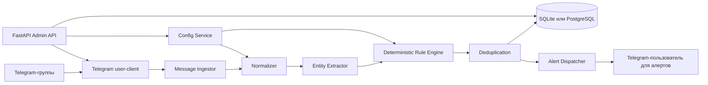

# Описание проекта: FastAPI-приложение для мониторинга Telegram-групп через user-аккаунт

**Рабочее название:** `tg-market-watch`  
**Тип проекта:** локальное или серверное FastAPI-приложение с Telegram MTProto-клиентом, подключённым как обычный Telegram user.  
**Основная задача:** автоматически отслеживать русскоязычные сообщения в выбранных Telegram-группах, находить объявления, подходящие под детерминированные правила из YAML-конфига, и отправлять уведомления другому Telegram-пользователю со ссылкой на исходное сообщение.

Документ описывает архитектуру, правила, нормализацию текста, словари синонимов, алгоритм матчинга, формат YAML-конфига, систему сигнализации, хранение данных, API, тестирование, эксплуатацию и ограничения.

---

## 1. Краткая идея

Приложение запускается как FastAPI-сервис. Внутри него поднимается асинхронный Telegram-клиент, авторизованный не через Bot API, а через Telegram user-аккаунт. Такой аккаунт можно вручную добавить в русскоязычные группы, после чего сервис слушает новые сообщения, применяет нормализацию, извлекает сущности и проверяет сообщения по детерминированным правилам.

Начальные правила отслеживания:

1. Продажа любого телевизора с диагональю **50+ дюймов**.
2. Продажа **MacBook с чипом M4 Pro**.
3. Продажа **AirPods Pro 2**.

Система не использует LLM для принятия решения в рантайме. Все совпадения объяснимы: каждая сработка содержит правило, найденные признаки, нормализованный фрагмент, числовые параметры и причину, почему сообщение прошло или не прошло фильтр.

---

## 2. Цели проекта

### 2.1. Функциональные цели

- Подключаться к Telegram как user-аккаунт через MTProto-клиент.
- Работать с группами, супергруппами и каналами, куда user-аккаунт был добавлен вручную.
- Читать новые сообщения и, при включённой опции, отредактированные сообщения.
- Загружать условия отслеживания из локального YAML-файла.
- Поддерживать детерминированную нормализацию русскоязычного текста, включая синонимы, смешанную кириллицу/латиницу, опечатки в пределах правил, разные варианты написания моделей и единиц измерения.
- Находить объявления о продаже товаров по заданным условиям.
- Отправлять уведомление выбранному Telegram-пользователю, в личный чат или служебный чат, с ссылкой на сообщение и объяснением сработки.
- Хранить историю обработанных сообщений, совпадений, отправленных алертов и версий конфига.
- Давать локальный HTTP API для статуса, перезагрузки конфига, тестирования правил и просмотра последних сработок.

### 2.2. Нефункциональные цели

- Детерминированность: одинаковый текст при одинаковом YAML-конфиге всегда даёт одинаковый результат.
- Объяснимость: каждая сработка содержит список доказательств.
- Устойчивость: сервис переживает перезапуск, не отправляет дубли и умеет догонять пропущенные сообщения.
- Безопасность: Telegram-сессия и секреты не попадают в логи и не хранятся в открытом виде.
- Локальность: правила и словари управляются локально через YAML, без необходимости внешней панели управления.
- Расширяемость: новые товарные правила добавляются без изменения кода.

---

## 3. Технологический выбор

### 3.1. FastAPI

FastAPI используется как управляющая оболочка: HTTP API, health-check, reload YAML-конфига, просмотр статуса и ручное тестирование сообщений. Для запуска и остановки долгоживущего Telegram-клиента рекомендуется использовать `lifespan`, потому что это логика старта и graceful shutdown всего приложения. `BackgroundTasks` в FastAPI подходит для задач после HTTP-ответа, но не является основным механизмом для постоянного Telegram-listener.

### 3.2. Telegram MTProto client

Для подключения как user-аккаунт предлагается использовать **Telethon**. Он поддерживает авторизацию существующего user-аккаунта, получение кода, 2FA-пароль и прослушивание событий новых сообщений через `NewMessage`.

Важное архитектурное решение: это именно user-client, а не классический Telegram Bot API-бот. User-аккаунт вручную добавляется в группы, которые нужно мониторить. Сервис не должен пытаться обходить приватность, получать доступ к группам без разрешения или массово вступать в чаты.

### 3.3. Хранилище

Для MVP достаточно SQLite с `aiosqlite` или SQLAlchemy async. Для продакшен-нагрузки лучше PostgreSQL.

Рекомендуемый подход:

- SQLite для локальной установки и первых запусков.
- PostgreSQL для VPS, большого количества групп и долгого хранения истории.
- Redis необязателен; можно добавить позже для rate-limit, очередей и распределённых блокировок.

---

## 4. Границы проекта

### 4.1. Входит в проект

- Авторизация Telegram user-аккаунта.
- Слушатель сообщений в выбранных чатах.
- YAML-конфигурация правил и словарей.
- Мощная нормализация текста.
- Детерминированный rule engine.
- Уведомления в Telegram.
- Локальный FastAPI API.
- SQLite/PostgreSQL-хранилище.
- Набор тестов на нормализацию, извлечение сущностей и правила.
- Логи, метрики и диагностика.

### 4.2. Не входит в MVP

- OCR изображений объявлений.
- Распознавание аудио и голосовых сообщений.
- ML/LLM-классификация в рантайме.
- Парсинг внешних сайтов по ссылкам из сообщений.
- Автоматическое вступление в приватные группы.
- Обход ограничений Telegram, скрытых настроек приватности или антиспам-механик.
- Массовая рассылка сообщений.

Эти функции можно добавить позже как отдельные модули, но базовая версия должна оставаться детерминированной и объяснимой.

---

## 5. Общая архитектура



### 5.1. Основные компоненты

#### `FastAPI App`

Отвечает за:

- запуск и остановку Telegram-клиента;
- HTTP API;
- проверку состояния;
- ручную перезагрузку YAML-конфига;
- тестирование правил на произвольном тексте;
- просмотр последних совпадений и ошибок.

#### `TelegramClientService`

Отвечает за:

- авторизацию user-аккаунта;
- хранение session-файла;
- подписку на события `NewMessage` и `MessageEdited`;
- получение метаданных чата;
- построение ссылок на сообщения;
- отправку алертов.

#### `ConfigService`

Отвечает за:

- чтение YAML-файла;
- валидацию через Pydantic-модели;
- сборку словарей;
- компиляцию правил;
- атомарную замену активной версии конфига;
- сохранение хэша и версии конфига в БД.

#### `Normalizer`

Отвечает за:

- Unicode-нормализацию;
- приведение регистра;
- замену `ё` на `е`;
- удаление zero-width символов;
- исправление смешанной кириллицы и латиницы в известных токенах;
- нормализацию пунктуации, валют, размеров и единиц измерения;
- токенизацию;
- построение n-грамм;
- канонизацию товарных терминов.

#### `EntityExtractor`

Отвечает за извлечение:

- намерения сообщения: продажа, покупка, обмен, ремонт, обзор, аксессуар;
- товарной категории;
- бренда;
- модели;
- числовых параметров: диагональ, поколение, чип, объём памяти, цена;
- состояния товара;
- признаков подделки, реплики или аксессуара;
- географии, если она нужна для будущих фильтров.

#### `RuleEngine`

Отвечает за:

- детерминированную проверку правил;
- логическое объединение условий;
- проверку числовых ограничений;
- обработку исключающих признаков;
- расчёт объяснимого score, если включён скоринг;
- выдачу результата `MATCH`, `NO_MATCH`, `REJECTED_BY_NEGATIVE`, `INSUFFICIENT_EVIDENCE`.

#### `DeduplicationService`

Отвечает за:

- защиту от повторных алертов по одному и тому же сообщению;
- защиту от дублей при редактировании сообщения;
- защиту от дублей при перезапуске сервиса;
- объединение одинаковых пересланных объявлений, если включён fingerprint по тексту.

#### `AlertDispatcher`

Отвечает за:

- форматирование уведомлений;
- отправку в личный чат или служебный чат;
- rate-limit;
- retry при временных ошибках;
- логирование успешных и неуспешных отправок.

---

## 6. Режим работы приложения

### 6.1. Запуск

1. FastAPI-приложение стартует.
2. `ConfigService` читает YAML-файл.
3. Конфиг валидируется.
4. Словари и правила компилируются.
5. Telegram-клиент подключается к session-файлу.
6. Если session-файл отсутствует, выполняется первичная авторизация через телефон, код Telegram и 2FA-пароль при необходимости.
7. Сервис проверяет доступность указанных чатов.
8. Запускается слушатель новых сообщений.
9. API переходит в состояние `ready`.

### 6.2. Обработка нового сообщения

1. Приходит Telegram-событие нового сообщения.
2. Проверяется, что чат входит в whitelist из YAML.
3. Формируется `RawMessage`.
4. Сервис проверяет, не обработан ли уже `chat_id + message_id + edit_version`.
5. Текст и caption медиа передаются в `Normalizer`.
6. Из нормализованного текста извлекаются сущности.
7. `RuleEngine` проверяет сообщение по всем включённым правилам.
8. Для каждого совпадения формируется `MatchRecord`.
9. `DeduplicationService` проверяет, не был ли уже отправлен такой же алерт.
10. `AlertDispatcher` отправляет уведомление целевому пользователю.
11. В БД сохраняются сообщение, совпадение, алерт и версия правил.

### 6.3. Догон пропущенных сообщений

Даже при стабильном Telegram-клиенте возможны сетевые сбои, рестарты, временное отсутствие интернета и задержки обновлений. Поэтому нужен механизм catch-up:

1. Для каждого monitored chat хранится последний обработанный `message_id`.
2. Раз в заданный интервал сервис получает последние N сообщений каждого чата.
3. Сообщения с `message_id` больше последнего обработанного прогоняются через тот же pipeline.
4. Дедупликация гарантирует, что алерты не отправятся повторно.

Рекомендуемый интервал для MVP: 60–300 секунд. Значение задаётся в YAML.

---

## 7. YAML-конфигурация

Ниже приведён полный стартовый пример конфига. Значения `TG_API_ID`, `TG_API_HASH`, `TG_PHONE` и `ADMIN_API_TOKEN` читаются из переменных окружения. Это не секреты в YAML, а имена переменных, из которых приложение берёт реальные значения.

```yaml
version: 1

app:
  name: "tg-market-watch"
  environment: "local"
  timezone: "Asia/Tbilisi"
  admin_api_token_env: "ADMIN_API_TOKEN"
  data_dir: "./var"
  log_level: "INFO"

telegram:
  session_file: "./var/telegram/session.marketwatch"
  api_id_env: "TG_API_ID"
  api_hash_env: "TG_API_HASH"
  phone_env: "TG_PHONE"
  connect_timeout_seconds: 20
  request_timeout_seconds: 30
  sequential_updates: true
  process_new_messages: true
  process_edited_messages: true
  ignore_outgoing_messages: true
  monitored_chats:
    - title: "Барахолка Москва"
      peer: "@baraholka_msk"
      enabled: true
    - title: "Барахолка СПб"
      peer: "@baraholka_spb"
      enabled: true
    - title: "Приватная группа техники"
      peer_id: -1001234567890
      enabled: true
  alert_targets:
    - title: "Основной получатель"
      peer: "market_alerts_receiver"
      enabled: true
  alert_message:
    include_original_text: true
    include_normalized_excerpt: true
    include_evidence: true
    include_forwarded_message_when_link_unavailable: true
    max_original_text_chars: 900

storage:
  driver: "sqlite"
  sqlite_path: "./var/db/tg_market_watch.sqlite3"
  retention_days_messages: 30
  retention_days_matches: 180
  store_full_text: true
  store_sender_id: true

catch_up:
  enabled: true
  interval_seconds: 120
  messages_per_chat_limit: 80

normalization:
  unicode_nfkc: true
  lowercase: true
  replace_yo_with_e: true
  remove_zero_width_chars: true
  normalize_quotes: true
  normalize_dashes: true
  normalize_currency: true
  fix_mixed_cyrillic_latin_for_known_terms: true
  fix_keyboard_layout_for_known_terms: true
  transliterate_known_product_terms: true
  collapse_repeated_spaces: true
  max_edit_distance_for_dictionary_terms: 1
  use_edit_distance_only_for_terms_min_length: 5
  token_window_for_context: 8

engine:
  deterministic: true
  default_rule_threshold: 100
  global_reject_if_any_intent:
    - "buy"
    - "repair"
    - "review"
    - "rent"
    - "wanted"
  deduplicate_alerts: true
  duplicate_text_fingerprint_window_hours: 24
  alert_rate_limit_per_minute: 20
  dry_run: false

dictionaries:
  groups:
    intent.sale:
      canonical: "sale"
      terms:
        - "продам"
        - "продаю"
        - "продается"
        - "продаётся"
        - "в продаже"
        - "отдам"
        - "уступлю"
        - "есть в наличии"
        - "в наличии"
        - "sell"
        - "selling"
    intent.buy:
      canonical: "buy"
      terms:
        - "куплю"
        - "покупаю"
        - "ищу"
        - "нужен"
        - "нужна"
        - "нужно"
        - "приобрету"
        - "рассмотрю покупку"
        - "wanted"
    intent.repair:
      canonical: "repair"
      terms:
        - "ремонт"
        - "починю"
        - "чиню"
        - "запчасти"
        - "разбор"
        - "донор"
    intent.review:
      canonical: "review"
      terms:
        - "обзор"
        - "отзыв"
        - "сравнение"
        - "видео"
        - "распаковка"
    intent.rent:
      canonical: "rent"
      terms:
        - "аренда"
        - "сдам"
        - "сниму"
        - "прокат"

    product.tv:
      canonical: "tv"
      terms:
        - "телевизор"
        - "телек"
        - "телик"
        - "тв"
        - "tv"
        - "smart tv"
        - "смарт тв"
        - "смарт телевизор"
        - "oled"
        - "qled"
        - "led tv"
        - "жк телевизор"
        - "плазма"
        - "панель"
    product.macbook:
      canonical: "macbook"
      terms:
        - "macbook"
        - "mac book"
        - "макбук"
        - "мак book"
        - "mbp"
        - "macbook pro"
        - "макбук про"
        - "макбук pro"
    product.airpods:
      canonical: "airpods"
      terms:
        - "airpods"
        - "air pods"
        - "air-pods"
        - "эйрподс"
        - "аирподс"
        - "эйр pods"
        - "наушники apple"
        - "apple airpods"

    apple.chip.m4:
      canonical: "m4"
      terms:
        - "m4"
        - "м4"
        - "эм четыре"
    apple.chip.m4_pro:
      canonical: "m4_pro"
      terms:
        - "m4 pro"
        - "m4pro"
        - "m4-pro"
        - "м4 pro"
        - "м4 про"
        - "эм четыре про"
    apple.chip.m4_max:
      canonical: "m4_max"
      terms:
        - "m4 max"
        - "m4max"
        - "m4-max"
        - "м4 max"
        - "м4 макс"

    airpods.pro:
      canonical: "airpods_pro"
      terms:
        - "airpods pro"
        - "air pods pro"
        - "эйрподс про"
        - "аирподс про"
        - "airpodspro"
    airpods.generation_2:
      canonical: "generation_2"
      terms:
        - "2"
        - "2nd"
        - "second generation"
        - "2 поколение"
        - "второе поколение"
        - "gen 2"
        - "generation 2"
        - "a2698"
        - "a2699"
        - "a2700"
        - "a3047"
        - "a3048"
        - "a3049"

    product.fake:
      canonical: "fake"
      terms:
        - "копия"
        - "реплика"
        - "не оригинал"
        - "паль"
        - "люкс копия"
        - "mastercopy"
        - "oem копия"
    product.accessory:
      canonical: "accessory"
      terms:
        - "чехол"
        - "кабель"
        - "коробка"
        - "амбушюры"
        - "зарядка"
        - "пульт"
        - "кронштейн"
        - "подставка"

rules:
  - id: "tv_50_plus_sale"
    title: "Телевизор 50+ дюймов"
    enabled: true
    priority: "high"
    threshold: 100
    require_intent_any:
      - "intent.sale"
    reject_intent_any:
      - "intent.buy"
      - "intent.repair"
      - "intent.review"
      - "intent.rent"
    reject_dictionary_any:
      - "product.accessory"
    require_dictionary_any:
      - "product.tv"
    numeric_constraints:
      - entity: "diagonal_inches"
        operator: ">="
        value: 50
        required: true
        context_dictionary_any:
          - "product.tv"
        context_window_tokens: 10
    evidence_weights:
      intent.sale: 30
      product.tv: 40
      diagonal_inches: 40
    alert_template_id: "default_market_match"

  - id: "macbook_m4_pro_sale"
    title: "MacBook с чипом M4 Pro"
    enabled: true
    priority: "high"
    threshold: 100
    require_intent_any:
      - "intent.sale"
    reject_intent_any:
      - "intent.buy"
      - "intent.repair"
      - "intent.review"
      - "intent.rent"
    require_dictionary_all:
      - "product.macbook"
      - "apple.chip.m4_pro"
    reject_dictionary_any:
      - "apple.chip.m4_max"
      - "product.accessory"
    evidence_weights:
      intent.sale: 30
      product.macbook: 40
      apple.chip.m4_pro: 50
    alert_template_id: "default_market_match"

  - id: "airpods_pro_2_sale"
    title: "AirPods Pro 2"
    enabled: true
    priority: "medium"
    threshold: 100
    require_intent_any:
      - "intent.sale"
    reject_intent_any:
      - "intent.buy"
      - "intent.repair"
      - "intent.review"
      - "intent.rent"
    require_dictionary_all:
      - "product.airpods"
      - "airpods.pro"
      - "airpods.generation_2"
    reject_dictionary_any:
      - "product.fake"
      - "product.accessory"
    evidence_weights:
      intent.sale: 30
      product.airpods: 30
      airpods.pro: 30
      airpods.generation_2: 40
    alert_template_id: "default_market_match"
```

---

## 8. Нормализация текста

Нормализация — самый важный слой проекта. Она превращает хаотичные русскоязычные сообщения в устойчивое представление, пригодное для детерминированного поиска.

### 8.1. Входные данные

Источник текста:

- `message.text`;
- `message.caption` для сообщений с фото или видео;
- опционально имя файла документа, если это объявление с вложением;
- метаданные чата и отправителя не участвуют в текстовом матчинге, но сохраняются для алерта.

### 8.2. Этапы нормализации

#### Этап 1. Unicode и базовая очистка

- Применить Unicode NFKC.
- Перевести строку в нижний регистр.
- Заменить `ё` на `е`.
- Удалить zero-width символы.
- Нормализовать кавычки: `“”„«»` → `"`.
- Нормализовать тире: `–`, `—`, `−` → `-`.
- Свести повторяющиеся пробелы к одному.
- Сохранить карту позиций, чтобы можно было показать исходный фрагмент в алерте.

#### Этап 2. Смешанная кириллица и латиница

В объявлениях часто встречаются токены с визуально похожими буквами:

- `mаcbook`, где `а` кириллическая;
- `аirpods`, где первая `а` кириллическая;
- `sаmsung`, где `а` кириллическая.

Сервис применяет confusable mapping только для токенов, которые потенциально совпадают со словарём. Это снижает риск ложных исправлений обычных русских слов.

Пример:

| Исходный токен | После нормализации | Причина |
|---|---:|---|
| `mаcbook` | `macbook` | найдено в словаре `product.macbook` |
| `аirpods` | `airpods` | найдено в словаре `product.airpods` |
| `тв` | `тв` | русское слово не переводится в латиницу |

#### Этап 3. Исправление неверной раскладки

Часть пользователей печатает английские бренды в русской раскладке:

| Исходный токен | После исправления |
|---|---:|
| `ьфсищщл` | `macbook` |
| `фшкзщвы` | `airpods` |
| `ыфьыгтп` | `samsung` |

Исправление применяется только если исправленный токен попадает в словарь. Сервис не должен массово исправлять все слова, иначе появятся ложные совпадения.

#### Этап 4. Транслитерация известных терминов

Канонические формы для словаря:

| Вариант | Каноническая форма |
|---|---:|
| `макбук`, `mac book`, `mbp` | `macbook` |
| `эйрподс`, `аирподс`, `air pods` | `airpods` |
| `телик`, `телек`, `тв`, `smart tv` | `tv` |
| `м4 про`, `m4pro`, `m4-pro` | `m4_pro` |

#### Этап 5. Токенизация

Токенизация должна учитывать:

- пробелы;
- пунктуацию;
- дефисы;
- слэши;
- эмодзи;
- валюты;
- числа с единицами измерения;
- модельные токены вроде `oled55c3`, `ue55cu8000`, `a2698`.

Результат нормализации хранится как:

```text
original_text: "Продам телек Samsung 55\" в отличном состоянии"
normalized_text: "продам телек samsung 55\" в отличном состоянии"
tokens: ["продам", "телек", "samsung", "55", "дюйм", "в", "отличном", "состоянии"]
canonical_tokens: ["sale", "tv", "samsung", "55", "inch", "в", "отличном", "состоянии"]
```

#### Этап 6. N-граммы

Для устойчивого поиска модельных фраз строятся n-граммы длиной 1–4 токена:

- `macbook`;
- `macbook pro`;
- `m4 pro`;
- `airpods pro 2`;
- `smart tv 55`.

Для словарей используется стратегия longest match first: если найдено `airpods pro`, то отдельные `airpods` и `pro` сохраняются как вложенные признаки, но в объяснении показывается самый длинный релевантный матч.

---

## 9. Извлечение сущностей

### 9.1. Намерение сообщения

Намерение нужно, чтобы отличать продажу от покупки, ремонта и обсуждения.

Примеры:

| Сообщение | Намерение | Результат |
|---|---:|---|
| `Продам телевизор LG 55` | sale | можно проверять правила |
| `Куплю телевизор 55` | buy | отклонить |
| `Ищу AirPods Pro 2` | buy | отклонить |
| `Ремонт MacBook M4 Pro` | repair | отклонить |
| `Обзор MacBook M4 Pro` | review | отклонить |
| `Продам или обменяю MacBook M4 Pro` | sale + exchange | принять, если exchange не запрещён |

Намерение определяется словарём и контекстом. Если в сообщении одновременно есть `продам` и `куплю`, приоритет отдаётся ближайшему к товарной сущности намерению. Если уверенного намерения нет, правило может работать в одном из двух режимов:

- `strict_sale_intent`: нужен явный признак продажи;
- `market_group_default_sale`: в whitelisted барахолке сообщение без `куплю`, `ищу`, `ремонт` допускается как потенциальная продажа.

Для начальной версии рекомендуется `strict_sale_intent`, потому что он снижает количество ложных алертов.

### 9.2. Диагональ телевизора

Извлекаются следующие варианты:

| Исходный фрагмент | Извлечённая диагональ |
|---|---:|
| `55"` | 55 inches |
| `55 дюймов` | 55 inches |
| `55 д` | 55 inches |
| `55 inch` | 55 inches |
| `телевизор 50+` | 50 inches, lower_bound = true |
| `от 50 дюймов` | 50 inches, lower_bound = true |
| `127 см диагональ` | 50 inches |
| `OLED55C3` | 55 inches |
| `UE55CU8000` | 55 inches |
| `KD-55X85` | 55 inches |

Правила защиты от ложных чисел:

- число рядом с `руб`, `₽`, `р`, `тыс`, `k` считается ценой, а не диагональю;
- число рядом с `гб`, `gb`, `tb`, `тб` считается памятью;
- число рядом с `гц`, `hz` считается частотой;
- число рядом с `год`, `2024`, `2025` считается годом;
- число считается диагональю без единицы только если оно находится рядом с TV-термином или внутри TV-модели.

Пример ложного совпадения, которое нужно отклонить:

```text
Продам телевизор Samsung, 45 000 руб, 4K, 120 Гц
```

Здесь нет диагонали 50+, поэтому правило `tv_50_plus_sale` не срабатывает.

### 9.3. MacBook M4 Pro

Система должна отличать несколько похожих случаев:

| Сообщение | Результат |
|---|---:|
| `Продам MacBook Pro на M4 Pro 24/512` | match |
| `Продам макбук m4pro 14` | match |
| `Продам MBP M4 Pro` | match |
| `Продам MacBook Pro M4 Max` | no match, если `M4 Max` исключён |
| `Продам MacBook Air M4` | no match |
| `Куплю MacBook M4 Pro` | no match |
| `Продам чехол для MacBook M4 Pro` | no match |

Начальное правило трактует `MacBook M4 Pro` как **MacBook с чипом M4 Pro**. Если нужно также ловить `MacBook Pro с обычным M4`, для этого стоит добавить отдельное правило `macbook_pro_m4_sale`.

### 9.4. AirPods Pro 2

Система должна распознавать:

| Сообщение | Результат |
|---|---:|
| `Продам AirPods Pro 2` | match |
| `Продам эйрподс про 2` | match |
| `AirPods Pro second generation в продаже` | match |
| `Продам AirPods Pro A2698` | match |
| `Куплю AirPods Pro 2` | no match |
| `Продам копию AirPods Pro 2` | no match при включённом reject fake |
| `Продам чехол AirPods Pro 2` | no match |

Для AirPods Pro 2 поколение определяется по словам `2`, `2nd`, `second generation`, `2 поколение`, `gen 2`, а также по model identifier. В YAML уже включены идентификаторы `a2698`, `a2699`, `a2700`, `a3047`, `a3048`, `a3049`.

---

## 10. Детерминированный алгоритм матчинга

### 10.1. Принцип

Каждое правило состоит из:

- обязательных словарных групп;
- альтернативных словарных групп;
- исключающих словарных групп;
- обязательного или необязательного намерения;
- числовых условий;
- контекстных окон;
- минимального score;
- шаблона алерта.

Решение принимается без случайности и без обращения к внешней модели. Все входные данные — нормализованный текст, словари, регулярные выражения и YAML-правила.

### 10.2. Псевдокод

```python
def process_message(raw_message, compiled_config, storage):
    message_key = f"{raw_message.chat_id}:{raw_message.message_id}:{raw_message.edit_version}"

    if storage.message_was_processed(message_key):
        return []

    normalized = normalize_text(raw_message.text, compiled_config.normalization)
    entities = extract_entities(normalized, compiled_config.dictionaries)
    matches = []

    for rule in compiled_config.enabled_rules:
        decision = evaluate_rule(rule, normalized, entities)
        if decision.status == "MATCH":
            matches.append(decision)

    storage.save_processed_message(raw_message, normalized, entities, matches)
    return matches


def evaluate_rule(rule, normalized, entities):
    evidence = []
    score = 0

    if has_any(entities.intents, rule.reject_intent_any):
        return rejected("REJECTED_BY_NEGATIVE_INTENT", evidence)

    if has_any(entities.dictionary_hits, rule.reject_dictionary_any):
        return rejected("REJECTED_BY_NEGATIVE_DICTIONARY", evidence)

    if rule.require_intent_any and not has_any(entities.intents, rule.require_intent_any):
        return rejected("MISSING_REQUIRED_INTENT", evidence)

    for group in rule.require_dictionary_all:
        if not has_group(entities.dictionary_hits, group):
            return rejected("MISSING_REQUIRED_DICTIONARY_GROUP", evidence)
        evidence.append(group)
        score += rule.evidence_weights.get(group, 0)

    if rule.require_dictionary_any and not has_any(entities.dictionary_hits, rule.require_dictionary_any):
        return rejected("MISSING_REQUIRED_DICTIONARY_ANY", evidence)

    for group in rule.require_dictionary_any:
        if has_group(entities.dictionary_hits, group):
            evidence.append(group)
            score += rule.evidence_weights.get(group, 0)

    for constraint in rule.numeric_constraints:
        result = check_numeric_constraint(constraint, normalized, entities)
        if constraint.required and not result.passed:
            return rejected("MISSING_OR_FAILED_NUMERIC_CONSTRAINT", evidence)
        if result.passed:
            evidence.append(result.evidence_key)
            score += rule.evidence_weights.get(constraint.entity, 0)

    for intent in rule.require_intent_any:
        if has_group(entities.intents, intent):
            evidence.append(intent)
            score += rule.evidence_weights.get(intent, 0)

    if score >= rule.threshold:
        return matched(rule.id, score, evidence)

    return rejected("SCORE_BELOW_THRESHOLD", evidence)
```

### 10.3. Контекстное окно

Контекстное окно нужно, чтобы связывать числовые признаки с товаром.

Пример:

```text
Продам телевизор Samsung 55, тумба 120 см в подарок
```

Здесь `55` рядом с `телевизор`, а `120 см` рядом с `тумба`. Правило должно выбрать `55` как диагональ и не спутать `120 см` с диагональю.

Для каждого числового признака сохраняются позиции токенов. Условие `context_window_tokens: 10` означает, что рядом с числом в пределах 10 токенов должен быть термин из заданной товарной группы.

### 10.4. Отрицательные признаки

Отрицательные признаки имеют приоритет над score. Если сообщение содержит запрещённый intent или запрещённую категорию, оно отклоняется до расчёта score.

Примеры:

- `Куплю телевизор 55` — отклонить из-за `intent.buy`.
- `Ремонт телевизоров Samsung 55` — отклонить из-за `intent.repair`.
- `Чехол для AirPods Pro 2` — отклонить из-за `product.accessory`.
- `Копия AirPods Pro 2` — отклонить из-за `product.fake`, если правило запрещает реплики.

### 10.5. Объяснение решения

Для каждого match сохраняется объяснение:

```json
{
  "rule_id": "tv_50_plus_sale",
  "status": "MATCH",
  "score": 110,
  "evidence": [
    {
      "type": "intent",
      "group": "intent.sale",
      "matched_text": "продам",
      "canonical": "sale"
    },
    {
      "type": "dictionary",
      "group": "product.tv",
      "matched_text": "телек",
      "canonical": "tv"
    },
    {
      "type": "numeric",
      "entity": "diagonal_inches",
      "matched_text": "55\"",
      "value": 55,
      "operator": ">=",
      "required_value": 50
    }
  ],
  "rejection_reason": null
}
```

Даже для `NO_MATCH` полезно сохранять короткую причину в debug-режиме, чтобы настраивать правила.

---

## 11. Построение ссылок на сообщения

### 11.1. Публичные группы и каналы

Если у чата есть публичный username, ссылка строится так:

```text
https://t.me/baraholka_msk/12345
```

где `baraholka_msk` — username чата, а `12345` — `message_id`.

### 11.2. Приватные супергруппы и каналы

Для приватных супергрупп и каналов используется формат:

```text
https://t.me/c/1234567890/12345
```

где `1234567890` — внутренний ID без префикса `-100`, а `12345` — `message_id`.

Алгоритм:

```python
def build_private_supergroup_link(chat_id, message_id):
    internal_id = abs(chat_id) - 1000000000000
    return f"https://t.me/c/{internal_id}/{message_id}"
```

Пример:

```text
chat_id = -1001234567890
message_id = 12345
link = https://t.me/c/1234567890/12345
```

Такая ссылка будет открываться только у пользователей, у которых есть доступ к соответствующей приватной группе или каналу.

### 11.3. Приватные обычные группы

У обычных приватных групп может не быть универсальной ссылки на сообщение. В этом случае алерт должен:

- указать название чата;
- указать `chat_id` и `message_id`;
- при включённой настройке переслать или скопировать исходное сообщение получателю;
- предупредить, что ссылка недоступна или работает только для участников чата.

---

## 12. Формат уведомления

### 12.1. Базовый шаблон

```text
🔎 Найдено объявление: Телевизор 50+ дюймов

Правило: tv_50_plus_sale
Чат: Барахолка Москва
Автор: user_id 987654321
Ссылка: https://t.me/baraholka_msk/12345

Причина сработки:
• intent.sale: "продам"
• product.tv: "телек"
• diagonal_inches: 55 >= 50

Текст:
Продам телек Samsung 55" в отличном состоянии, 45000 руб.
```

### 12.2. Для MacBook

```text
🔎 Найдено объявление: MacBook с чипом M4 Pro

Правило: macbook_m4_pro_sale
Чат: Барахолка СПб
Ссылка: https://t.me/baraholka_spb/888

Причина сработки:
• intent.sale: "продам"
• product.macbook: "макбук"
• apple.chip.m4_pro: "m4 pro"

Текст:
Продам макбук 14 на M4 Pro, 24/512, идеал.
```

### 12.3. Для AirPods

```text
🔎 Найдено объявление: AirPods Pro 2

Правило: airpods_pro_2_sale
Чат: Приватная группа техники
Ссылка: https://t.me/c/1234567890/345

Причина сработки:
• intent.sale: "продам"
• product.airpods: "airpods"
• airpods.pro: "airpods pro"
• airpods.generation_2: "2"

Текст:
Продам AirPods Pro 2, оригинал, полный комплект.
```

---

## 13. FastAPI API

API должен быть закрыт admin-токеном. Для локальной установки можно слушать только `127.0.0.1`. Для VPS — закрыть порт firewall или поставить reverse proxy с авторизацией.

### 13.1. Health и статус

#### `GET /health`

Ответ:

```json
{
  "status": "ok",
  "app": "tg-market-watch"
}
```

#### `GET /status`

Ответ:

```json
{
  "status": "ready",
  "telegram_connected": true,
  "authorized": true,
  "active_config_hash": "b7c7f0c9d0a0a6d65b2c9e5f6a2bb1f0",
  "enabled_rules": 3,
  "enabled_chats": 3,
  "messages_processed_total": 15420,
  "matches_total": 38,
  "alerts_sent_total": 38,
  "last_message_at": "2026-05-23T10:15:30+04:00"
}
```

### 13.2. Авторизация Telegram

#### `POST /auth/send-code`

Запускает отправку кода Telegram на номер из `TG_PHONE`.

Ответ:

```json
{
  "status": "code_sent",
  "phone_from_env": true
}
```

#### `POST /auth/confirm-code`

Тело запроса:

```json
{
  "code": "12345"
}
```

Ответ:

```json
{
  "status": "authorized"
}
```

Если включена 2FA:

```json
{
  "status": "password_required"
}
```

#### `POST /auth/confirm-2fa`

Тело запроса:

```json
{
  "password": "correct horse battery staple"
}
```

Пароль не логируется и не сохраняется.

Ответ:

```json
{
  "status": "authorized"
}
```

### 13.3. Конфиг

#### `GET /config/active`

Возвращает активную версию конфига без секретов.

#### `POST /config/reload`

Перечитывает YAML-файл, валидирует его и атомарно заменяет правила.

Ответ:

```json
{
  "status": "reloaded",
  "config_hash": "b7c7f0c9d0a0a6d65b2c9e5f6a2bb1f0",
  "enabled_rules": 3,
  "enabled_chats": 3
}
```

Если конфиг невалиден, активная версия не меняется:

```json
{
  "status": "validation_failed",
  "errors": [
    {
      "path": "rules.0.numeric_constraints.0.value",
      "message": "value must be a number"
    }
  ]
}
```

### 13.4. Тестирование правил

#### `POST /rules/test`

Тело запроса:

```json
{
  "text": "Продам телек Samsung 55\" в отличном состоянии",
  "chat_title": "Ручной тест"
}
```

Ответ:

```json
{
  "normalized_text": "продам телек samsung 55\" в отличном состоянии",
  "tokens": ["продам", "телек", "samsung", "55", "дюйм", "в", "отличном", "состоянии"],
  "entities": {
    "intents": ["intent.sale"],
    "dictionary_hits": ["product.tv"],
    "numeric": [
      {
        "entity": "diagonal_inches",
        "value": 55,
        "matched_text": "55\""
      }
    ]
  },
  "matches": [
    {
      "rule_id": "tv_50_plus_sale",
      "status": "MATCH",
      "score": 110
    }
  ]
}
```

### 13.5. История

#### `GET /matches?limit=50`

Возвращает последние совпадения.

#### `GET /messages/{chat_id}/{message_id}`

Возвращает сохранённое сообщение, нормализацию и результаты правил.

#### `GET /chats`

Возвращает список отслеживаемых чатов, их статус и последний обработанный message ID.

---

## 14. Хранилище данных

### 14.1. Таблица `messages`

| Поле | Тип | Описание |
|---|---:|---|
| `id` | integer primary key | внутренний ID |
| `chat_id` | bigint | Telegram chat ID |
| `message_id` | bigint | Telegram message ID |
| `sender_id` | bigint nullable | Telegram sender ID |
| `message_date` | datetime | дата сообщения |
| `text_hash` | text | SHA-256 исходного текста |
| `text_original` | text nullable | исходный текст, если включено хранение |
| `text_normalized` | text nullable | нормализованный текст |
| `entities_json` | json | извлечённые сущности |
| `processed_at` | datetime | время обработки |
| `config_hash` | text | версия конфига |

Уникальный индекс: `chat_id + message_id`.

### 14.2. Таблица `matches`

| Поле | Тип | Описание |
|---|---:|---|
| `id` | integer primary key | внутренний ID |
| `message_db_id` | integer | ссылка на `messages.id` |
| `rule_id` | text | ID правила |
| `status` | text | `MATCH` |
| `score` | integer | итоговый score |
| `evidence_json` | json | список доказательств |
| `message_link` | text nullable | ссылка на Telegram-сообщение |
| `created_at` | datetime | время создания |

Уникальный индекс: `message_db_id + rule_id`.

### 14.3. Таблица `alerts`

| Поле | Тип | Описание |
|---|---:|---|
| `id` | integer primary key | внутренний ID |
| `match_id` | integer | ссылка на `matches.id` |
| `target_peer` | text | получатель |
| `telegram_alert_message_id` | bigint nullable | ID отправленного алерта |
| `status` | text | `sent`, `failed`, `rate_limited` |
| `error_text` | text nullable | ошибка |
| `sent_at` | datetime nullable | время отправки |

Уникальный индекс: `match_id + target_peer`.

### 14.4. Таблица `chat_offsets`

| Поле | Тип | Описание |
|---|---:|---|
| `chat_id` | bigint primary key | Telegram chat ID |
| `last_processed_message_id` | bigint | последний обработанный message ID |
| `last_seen_at` | datetime | время последнего события |
| `catch_up_at` | datetime nullable | время последнего catch-up |

### 14.5. Таблица `config_versions`

| Поле | Тип | Описание |
|---|---:|---|
| `config_hash` | text primary key | SHA-256 YAML-конфига |
| `version` | integer | `version` из YAML |
| `loaded_at` | datetime | время загрузки |
| `rules_count` | integer | количество правил |
| `enabled_rules_count` | integer | количество включённых правил |
| `raw_yaml_hash` | text | хэш исходного YAML |

---

## 15. Предлагаемая структура репозитория

```text
tg-market-watch/
  app/
    __init__.py
    main.py
    api/
      __init__.py
      auth.py
      config.py
      health.py
      matches.py
      rules.py
      status.py
    core/
      __init__.py
      settings.py
      security.py
      logging.py
      lifecycle.py
    config/
      __init__.py
      loader.py
      models.py
      compiler.py
      hashing.py
    telegram/
      __init__.py
      client_service.py
      auth_service.py
      message_ingestor.py
      link_builder.py
      alert_dispatcher.py
      catch_up.py
    engine/
      __init__.py
      normalizer.py
      tokenizer.py
      dictionaries.py
      entities.py
      numeric_extractors.py
      rule_engine.py
      decisions.py
      deduplication.py
    storage/
      __init__.py
      database.py
      repositories.py
      migrations.py
    observability/
      __init__.py
      metrics.py
      diagnostics.py
  config/
    watch.yaml
  tests/
    test_normalizer.py
    test_keyboard_layout.py
    test_dictionary_matching.py
    test_numeric_extractors.py
    test_rule_tv_50_plus.py
    test_rule_macbook_m4_pro.py
    test_rule_airpods_pro_2.py
    test_link_builder.py
    test_config_validation.py
  var/
    telegram/
      .gitkeep
    db/
      .gitkeep
  docker-compose.yml
  Dockerfile
  pyproject.toml
  README.md
```

---

## 16. Ключевые алгоритмы

### 16.1. Сборка словарей

При загрузке YAML:

1. Каждая словарная группа проверяется на уникальность ID.
2. Все термины приводятся к нормализованной форме.
3. Для каждого термина строятся токены и n-граммы.
4. Термины сортируются по длине по убыванию.
5. Создаётся индекс `term -> dictionary_group`.
6. Создаётся индекс `canonical -> groups`.
7. Создаётся набор терминов для correction pipeline.

### 16.2. Поиск словарных совпадений

Рекомендуемый алгоритм для MVP:

1. Построить n-граммы длиной 1–4.
2. Проверить точные совпадения по индексу.
3. Применить longest match first.
4. Для терминов длиной от 5 символов применить edit distance 1, если точного совпадения нет.
5. Для исправления раскладки проверить только токены, которые после конвертации попадают в словарь.
6. Для каждого совпадения сохранить исходный текст, нормализованный текст, позицию и canonical value.

Для высокой нагрузки можно заменить n-граммный проход на Aho-Corasick automaton, но логика результата остаётся такой же.

### 16.3. Извлечение диагонали

Для ТВ используются четыре источника:

1. Явная единица измерения: `55"`, `55 дюймов`, `55 inch`.
2. Нижняя граница: `50+`, `от 50`, `не меньше 50`.
3. Сантиметры диагонали: `127 см диагональ`, конвертация `127 / 2.54 = 50`.
4. Модель телевизора: `OLED55C3`, `UE55CU8000`, `KD-55X85`.

Результат хранится так:

```json
{
  "entity": "diagonal_inches",
  "value": 55,
  "value_type": "exact",
  "source": "explicit_unit",
  "matched_text": "55\"",
  "token_start": 3,
  "token_end": 4
}
```

Для `50+`:

```json
{
  "entity": "diagonal_inches",
  "value": 50,
  "value_type": "lower_bound",
  "source": "plus_suffix",
  "matched_text": "50+",
  "token_start": 2,
  "token_end": 3
}
```

### 16.4. Fingerprint дублей

Дубли бывают при:

- редактировании сообщения;
- повторной публикации одного объявления в нескольких группах;
- пересылке объявления;
- перезапуске сервиса.

Предлагаемый fingerprint:

```text
fingerprint = sha256(
  rule_id + "|" +
  canonical_product + "|" +
  normalized_text_without_price_and_punctuation
)
```

Для строгой дедупликации используется `chat_id + message_id + rule_id`. Для мягкой дедупликации используется fingerprint в окне `duplicate_text_fingerprint_window_hours`.

---

## 17. Примеры работы правил

### 17.1. Телевизор 50+ дюймов

| Сообщение | Ожидаемый результат | Причина |
|---|---:|---|
| `Продам телевизор Samsung 55"` | match | sale + tv + 55 inches |
| `Продам телик LG 50 дюймов` | match | sale + tv + 50 inches |
| `Продам OLED55C3` | match | sale + tv по `oled` + 55 из модели |
| `Продам телевизор, 45 000 руб` | no match | нет диагонали |
| `Куплю телевизор 65` | no match | buy intent |
| `Продам пульт от телевизора Samsung` | no match | accessory |
| `Ремонт телевизоров 55 дюймов` | no match | repair intent |

### 17.2. MacBook M4 Pro

| Сообщение | Ожидаемый результат | Причина |
|---|---:|---|
| `Продам MacBook Pro M4 Pro 14 24/512` | match | sale + macbook + m4_pro |
| `Продам макбук m4pro` | match | sale + macbook + m4_pro |
| `Продам MBP на м4 про` | match | sale + macbook + m4_pro |
| `Продам MacBook Pro M4 Max` | no match | m4_max excluded |
| `Продам MacBook Air M4` | no match | нет m4_pro |
| `Куплю MacBook M4 Pro` | no match | buy intent |
| `Продам чехол MacBook M4 Pro` | no match | accessory |

### 17.3. AirPods Pro 2

| Сообщение | Ожидаемый результат | Причина |
|---|---:|---|
| `Продам AirPods Pro 2` | match | sale + airpods + pro + generation 2 |
| `Продам эйрподс про 2 поколение` | match | sale + airpods + pro + generation 2 |
| `AirPods Pro A2698 в продаже` | match | sale + airpods_pro + generation by model ID |
| `Куплю AirPods Pro 2` | no match | buy intent |
| `Продам копию AirPods Pro 2` | no match | fake excluded |
| `Продам чехол для AirPods Pro 2` | no match | accessory excluded |

---

## 18. Логирование и метрики

### 18.1. Логи

Рекомендуемые события:

- `app.started`;
- `config.loaded`;
- `config.validation_failed`;
- `telegram.connected`;
- `telegram.disconnected`;
- `telegram.auth_required`;
- `message.received`;
- `message.processed`;
- `rule.matched`;
- `alert.sent`;
- `alert.failed`;
- `catch_up.started`;
- `catch_up.finished`.

В логах нельзя хранить:

- Telegram-код авторизации;
- 2FA-пароль;
- `api_hash`;
- полный session string;
- полный текст сообщения, если включён privacy-режим.

### 18.2. Метрики

Минимальный набор:

```text
messages_processed_total
messages_skipped_total
matches_total{rule_id="tv_50_plus_sale"}
alerts_sent_total{target="Основной получатель"}
alerts_failed_total
config_reload_total
config_reload_failed_total
telegram_reconnect_total
catch_up_runs_total
catch_up_messages_processed_total
rule_engine_processing_seconds
```

---

## 19. Безопасность и приватность

### 19.1. Telegram session-файл

Session-файл фактически даёт доступ к Telegram-аккаунту. Требования:

- хранить в отдельной директории `./var/telegram`;
- права доступа на Linux: `0600` для файла и `0700` для директории;
- не коммитить session-файл в Git;
- не отправлять session-файл в логи, алерты и issue-трекеры;
- использовать отдельный Telegram-аккаунт для мониторинга, а не личный основной аккаунт.

### 19.2. Секреты

Секреты хранятся только в переменных окружения:

- `TG_API_ID`;
- `TG_API_HASH`;
- `TG_PHONE`;
- `ADMIN_API_TOKEN`.

YAML содержит только имена переменных окружения, а не сами секреты.

### 19.3. Доступ к API

- По умолчанию FastAPI слушает `127.0.0.1`.
- Все admin endpoints требуют `ADMIN_API_TOKEN`.
- Для внешнего доступа используется reverse proxy с HTTPS и дополнительной авторизацией.
- Endpoint авторизации Telegram должен быть недоступен публично.

### 19.4. Приватность групп

Сервис должен использоваться только в группах, где владелец user-аккаунта имеет легальный доступ и где такой мониторинг не нарушает правила группы. Для приватных групп важно учитывать, что ссылка на сообщение может быть доступна только участникам этой группы.

### 19.5. Хранение сообщений

Настройки retention:

- исходные сообщения хранить 30 дней;
- matches хранить 180 дней;
- можно отключить `store_full_text`, оставив только hash, сущности и алерты;
- sender ID хранить только если он нужен для расследования дублей или ручной проверки.

---

## 20. Устойчивость и ошибки

### 20.1. Telegram disconnect

При обрыве соединения:

1. Telegram-клиент пытается переподключиться.
2. В статусе API появляется `telegram_connected: false`.
3. После восстановления запускается catch-up.
4. Ошибки сохраняются в логах и диагностике.

### 20.2. Flood wait и rate limit

Telegram может ограничивать частоту действий. Для отправки алертов нужна очередь:

- максимум `alert_rate_limit_per_minute` сообщений в минуту;
- retry с задержкой при временной ошибке;
- сохранение статуса `rate_limited`;
- отсутствие повторной отправки одного и того же алерта после retry.

### 20.3. Невалидный YAML

Если новый YAML невалиден:

- активный конфиг остаётся прежним;
- API возвращает список ошибок;
- в лог пишется `config.validation_failed`;
- Telegram listener продолжает работать на старой версии правил.

### 20.4. Миграция чатов

Обычные группы Telegram могут стать супергруппами. Поэтому хранение должно учитывать, что chat ID может измениться. Рекомендуется сохранять:

- `chat_id`;
- `peer_id`;
- `username`;
- `title`;
- `access_hash`, если библиотека предоставляет его в entity;
- дату последнего успешного resolve.

---

## 21. Тестирование

### 21.1. Unit-тесты нормализации

Проверки:

- `ё` → `е`;
- mixed latin/cyrillic;
- неверная раскладка;
- дефисы и кавычки;
- `m4pro` → `m4_pro`;
- `air pods` → `airpods`;
- `телик` → `tv`.

### 21.2. Unit-тесты numeric extraction

Проверки:

- `55"`;
- `55 дюймов`;
- `50+`;
- `от 50`;
- `127 см диагональ`;
- `OLED55C3`;
- цена не считается диагональю;
- частота `120 Гц` не считается диагональю;
- память `512 ГБ` не считается диагональю.

### 21.3. Unit-тесты правил

Для каждого правила нужен набор позитивных и негативных сообщений.

Минимальный набор для `tv_50_plus_sale`:

```text
MATCH: Продам телевизор Samsung 55"
MATCH: Продам телик LG 50 дюймов
MATCH: Продам OLED55C3
NO_MATCH: Куплю телевизор Samsung 55"
NO_MATCH: Продам телевизор Samsung 43"
NO_MATCH: Продам пульт для телевизора Samsung
NO_MATCH: Ремонт телевизоров 55 дюймов
```

Минимальный набор для `macbook_m4_pro_sale`:

```text
MATCH: Продам MacBook Pro M4 Pro 14 24/512
MATCH: Продам макбук m4pro
MATCH: Продам MBP м4 про
NO_MATCH: Куплю MacBook M4 Pro
NO_MATCH: Продам MacBook Air M4
NO_MATCH: Продам MacBook Pro M4 Max
NO_MATCH: Продам чехол MacBook M4 Pro
```

Минимальный набор для `airpods_pro_2_sale`:

```text
MATCH: Продам AirPods Pro 2
MATCH: Продам эйрподс про 2 поколение
MATCH: AirPods Pro A2698 в продаже
NO_MATCH: Куплю AirPods Pro 2
NO_MATCH: Продам копию AirPods Pro 2
NO_MATCH: Продам чехол AirPods Pro 2
```

### 21.4. Интеграционные тесты

- Загрузка YAML.
- Перезагрузка YAML без рестарта.
- Обработка synthetic Telegram message object.
- Сохранение message/match/alert в БД.
- Построение public link.
- Построение private supergroup link.
- Дедупликация повторной обработки.

### 21.5. Регрессионный набор

Каждое ложное срабатывание или пропуск добавляется в regression dataset:

```yaml
- text: "Продам телевизор Samsung, 45000 руб, 120 Гц"
  expected_matches: []
  reason: "нет диагонали, 120 — частота"

- text: "Продам OLED55C3"
  expected_matches:
    - "tv_50_plus_sale"
  reason: "55 извлекается из модели"
```

---

## 22. Развёртывание

### 22.1. Локальный запуск

- Python 3.11 или 3.12.
- Виртуальное окружение.
- SQLite.
- FastAPI слушает `127.0.0.1:8000`.
- Telegram session хранится в `./var/telegram`.

### 22.2. Docker

Рекомендуемый docker-compose состав:

- `app` — FastAPI + Telegram listener;
- volume `./var:/app/var`;
- bind mount `./config/watch.yaml:/app/config/watch.yaml:ro`;
- environment variables для Telegram и admin API.

Важно: запускать один worker процесса для одного Telegram session-файла. Несколько Uvicorn workers могут создать несколько конкурирующих Telegram-клиентов и привести к дублям.

### 22.3. VPS

- systemd или Docker Compose;
- закрытый порт FastAPI;
- регулярный backup `var/db` и `var/telegram`;
- мониторинг логов;
- автоматический рестарт при падении;
- отдельный Telegram-аккаунт для мониторинга.

---

## 23. Этапы реализации

### Этап 1. MVP

- FastAPI skeleton.
- Config loader.
- Telegram user-client authorization.
- NewMessage listener.
- Нормализация базового уровня.
- Словари из YAML.
- Три стартовых правила.
- Telegram alert dispatcher.
- SQLite-хранилище.
- `/health`, `/status`, `/rules/test`, `/config/reload`.

### Этап 2. Усиление качества

- Catch-up пропущенных сообщений.
- MessageEdited processing.
- Улучшенный numeric extractor для ТВ-моделей.
- Keyboard layout correction.
- Mixed Cyrillic/Latin correction.
- Regression dataset.
- Расширенные объяснения match/no match.

### Этап 3. Эксплуатационная надёжность

- Rate-limit очереди алертов.
- Retry policy.
- Метрики.
- Privacy mode.
- Retention cleanup.
- Docker Compose.
- Backup инструкция.

### Этап 4. Расширение правил

- Геофильтры.
- Фильтры по цене.
- Фильтры по состоянию.
- Отдельные профили алертов для разных пользователей.
- Поддержка нескольких YAML-файлов.
- Импорт/экспорт regression dataset.

---

## 24. Критерии приёмки

Проект считается готовым для первой рабочей версии, если выполняются условия:

1. Сервис авторизуется как Telegram user и после перезапуска использует сохранённую session.
2. User-аккаунт можно вручную добавить в группу, и сервис видит новые сообщения этой группы.
3. YAML-конфиг загружается и валидируется.
4. Три стартовых правила работают на позитивных и негативных тестах.
5. Алерт отправляется целевому Telegram-пользователю.
6. Алерт содержит название правила, чат, ссылку, текст и evidence.
7. Повторная обработка одного сообщения не отправляет дубль.
8. `/rules/test` показывает нормализацию, сущности и результат правил.
9. При невалидном YAML активная конфигурация не ломается.
10. Session-файл, Telegram-код, 2FA-пароль и `api_hash` не попадают в логи.

---

## 25. Основные риски и меры снижения

| Риск | Последствие | Мера снижения |
|---|---|---|
| Telegram session украдена | доступ к аккаунту | права 0600, отдельный аккаунт, backup с шифрованием |
| Сервис пропустил событие | нет алерта | catch-up по последним сообщениям |
| Ложные срабатывания | шум в алертах | negative dictionaries, regression dataset, strict sale intent |
| Слишком строгие правила | пропуск нужных объявлений | debug no-match, ручные тесты, расширение синонимов |
| Невалидный YAML | остановка матчинга | атомарная перезагрузка, старая версия остаётся активной |
| FloodWait при алертах | задержки уведомлений | очередь, rate-limit, retry |
| Private link недоступен получателю | получатель не видит сообщение | forward/copy fallback, предупреждение в алерте |
| Несколько workers | дубли и конфликт session | один Uvicorn worker на один session-файл |

---

## 26. Рекомендации по развитию словарей

Словари должны развиваться через реальные примеры сообщений. Процесс:

1. Собирать ложные срабатывания и пропуски.
2. Добавлять сообщение в regression dataset.
3. Обновлять словарь или правило.
4. Запускать тесты.
5. Перезагружать YAML.
6. Проверять `/rules/test` на спорных сообщениях.

Примеры будущих словарных расширений:

- бренды ТВ: `samsung`, `lg`, `sony`, `philips`, `xiaomi`, `hisense`, `tcl`;
- серии ТВ: `oled`, `qled`, `nano`, `bravia`, `ambilight`;
- MacBook размеры: `14`, `16`, `14-inch`, `16-inch`;
- память MacBook: `18/512`, `24/512`, `36/1tb`;
- AirPods кейс: `usb-c`, `lightning`, `magsafe`;
- состояние: `новый`, `запечатан`, `идеал`, `б/у`, `полный комплект`;
- цена: `45000`, `45к`, `45 k`, `45 тыс`, `45000 руб`.

---

## 27. Минимальные зависимости

Рекомендуемый стек:

- `fastapi` — HTTP API;
- `uvicorn` — ASGI server;
- `telethon` — Telegram MTProto user-client;
- `pydantic` — валидация YAML и settings;
- `pyyaml` или `ruamel.yaml` — чтение YAML;
- `sqlalchemy` + `aiosqlite` — SQLite async storage;
- `pytest` — тесты;
- `pytest-asyncio` — async-тесты;
- `python-dotenv` — локальная загрузка env при разработке;
- `prometheus-client` — метрики, если они нужны в первой версии.

Опционально:

- `rapidfuzz` — детерминированная edit-distance проверка словарных терминов;
- `pyahocorasick` — быстрый поиск по большому словарю;
- `watchfiles` — автоматическая перезагрузка YAML при изменении файла.

---

## 28. Важные проектные решения

1. **Не использовать LLM для финального решения.** LLM может помогать на этапе разработки словарей, но runtime matching должен быть детерминированным.
2. **Не использовать Bot API для чтения групп.** Требование проекта — подключение как user, поэтому используется MTProto client.
3. **Не доверять одному событийному потоку.** Нужен catch-up, чтобы закрывать сбои и перезапуски.
4. **Не отправлять алерт без evidence.** Каждый алерт должен объяснять, почему он отправлен.
5. **Не менять активный конфиг при ошибке YAML.** Только валидный конфиг заменяет текущий.
6. **Не запускать несколько workers на одну session.** Один Telegram user session — один listener process.
7. **Сначала точность, затем полнота.** Начальный режим strict sale intent снижает шум. Полноту можно повышать расширением словарей.

---

## 29. Ссылки на документацию

- FastAPI lifespan events: https://fastapi.tiangolo.com/advanced/events/
- FastAPI background tasks: https://fastapi.tiangolo.com/tutorial/background-tasks/
- Telethon TelegramClient: https://docs.telethon.dev/en/stable/modules/client.html
- Telethon Events Reference: https://docs.telethon.dev/en/stable/quick-references/events-reference.html
- Telethon Chats vs Channels: https://docs.telethon.dev/en/stable/concepts/chats-vs-channels.html

---

## 30. Итог

Проект `tg-market-watch` — это управляемый FastAPI-сервис с Telegram user-client, локальным YAML-конфигом, сильной нормализацией русскоязычного текста, словарями синонимов и полностью детерминированным rule engine. Начальная версия фокусируется на трёх правилах: телевизоры 50+ дюймов, MacBook с чипом M4 Pro и AirPods Pro 2. Архитектура позволяет добавлять новые правила без изменения кода, а система evidence делает каждую сработку проверяемой и объяснимой.
